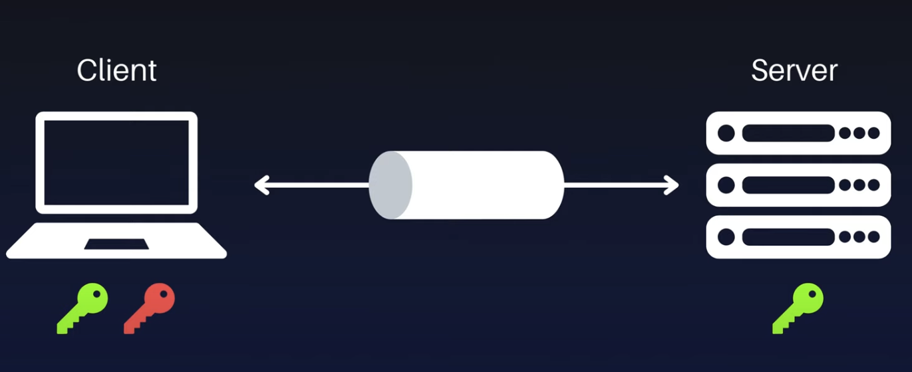
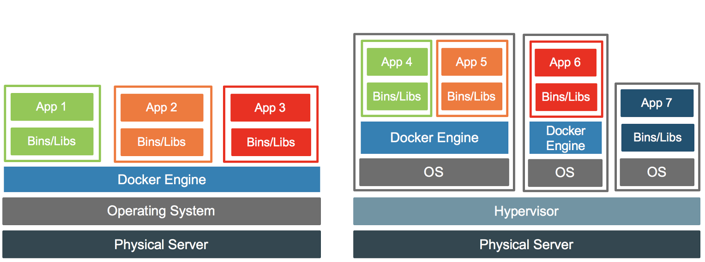

<!-- _class: lead -->

# Introduction to TEK2
### 3rd semester @ Erhvervsakademi København

<style>
section.lead h1 {
  text-align: center;
  font-size: 2.5em;
}
section.lead h3 {
  text-align: center;
  opacity: 0.6;
}
</style>

---

## Course Overview
**Course description**: https://katalog.kea.dk/course/3050352

**Workload**: 10 ECTS (14 hours per week - 3 hours lectures w/ exercises, 11 hours of self-study)

**Projects**: Full stack project, AI Project, Semester project

**Exam**: To attend the exam, you must have handed in and presented all projects
- 20 min oral presentation: approx. 9. - 13. january 2026
- Exam questions are known in advance

**Guest lectures during the semester**: 
- CEO of punktum.dk

---

## Tentative Plan: 
  - Docker + Docker Compose
  - GitHub Actions and workflows
  - Linux
  - Cloud VM & CD
  - DNS & HTTP(S)
  - TCP/IP model

---

<style>
  section.scaling {
    width: 100%;
    display: flex;
    align-items: center;
    justify-content: center;
  }

  section.scaling img {
    max-width: 90%;   /* scales down if too big */
    height: auto;     /* keeps aspect ratio */
    display: block;
  }
</style>

<!-- _class: lead -->

# SSH keys, Docker
### 3rd semester @ Erhvervsakademi København

<style>
section.lead h1 {
  text-align: center;
  font-size: 2.5em;
}
section.lead h3 {
  text-align: center;
  opacity: 0.6;
}
</style>

---

## Plan for today
- GitHub Student Developer Pack
- Setup SSH keys
- Authenticate GitHub with SSH
- Installing Docker Desktop
- Docker commands and concepts
- Hands-on exercises with Docker

---

## What is SSH?
- **SSH (Secure Shell)** is a protocol for securely accessing and managing remote systems over a network.
- We use **SSH** to connect to remote servers, execute commands, and transfer files securely.
- **SSH keys** are a pair of cryptographic keys used for authentication in SSH connections.

---

## SSH keys:

- SSH uses a pair of keys:
  - **Public Key**: Shared with the server, allowing it to verify the identity of the client.
  - **Private Key**: Kept secret by the client, used to authenticate against the server.
- **The public key is stored on the server, while the private key remains on the client.**

---




---

## How SSH Works
<!-- 1. The client generates a key pair (public and private keys).
2. The public key is copied to the server's `~/.ssh/authorized_keys` file. -->
#### Assume that the client has the private key and the server has the public key.
1. When the client connects to the server, it sends a request to authenticate using the public key.
2. The server checks if the public key matches any in its `authorized_keys` file.
3. If a match is found, the server sends a challenge that can only be answered with the private key.
4. If the client responds with the correct answer, the server grants access.

#### Analogy:
Everybody can see the **public key** (like a lock), but only the owner has the **private key** (like a key to that lock).

---

## Setting up SSH keys with GitHub

- We will generate a new SSH key pair on your local machine.
- The public key will be added to your GitHub account.
- This allows you to authenticate with GitHub without entering your username and password every time.
- This will allow you to clone, push, and pull repositories securely using your terminal.

---

<!-- _class: lead -->
# [Exercise: Generate SSH keys](https://github.com/ek-osnb/e25-tek2/tree/main/01-ssh-docker/guides/01-generate-ssh-keys.md)

---

<!-- _class: lead -->
# Docker

---

# Why Docker?

## **Solves "works on my machine"** by packaging app + dependencies into portable containers that run the same everywhere.

---

# Docker 101

- **Dockerfile**: 
Instructions to build an image (base image, deps, config).

- **Docker Image**: 
A read-only template that contains the application code, libraries, and dependencies needed to run an application.

- **Docker Container**: 
A running instance of a Docker image. It includes everything needed to run the application.

- **Docker Engine**:
The runtime that builds and runs containers.

---

<!-- _class: scaling -->


---

## What is Docker?
- **Docker** is a platform for developing, shipping, and running applications in containers.
- **Containers** are lightweight, portable, and self-sufficient units that package an application and its dependencies.
- **Docker Engine** is the runtime that allows you to build and run containers.
- **Docker Hub** is a cloud-based registry for sharing and managing Docker images.

---


<!-- _class: scaling -->


---

# Docker vs Virtual Machines
- **Docker**
Virtualizes the OS, sharing the kernel and isolating processes. Much more lightweight and efficient than VMs.

- **Virtual Machines**
Virtualizes the hardware, running a full OS with its own kernel.




<style>
img {
  max-width: 70%;
  height: auto;
}
</style>

---

<!-- _class: lead -->
# [Exercise: Docker install](https://github.com/ek-osnb/e25-tek2/tree/main/01-ssh-docker/guides/02-docker-install.md)

---

# Creating a Dockerfile
A **Dockerfile** is a text file that contains instructions to build a Docker image.

It defines the base image, installs dependencies, copies files, and sets up the environment for the application.

```dockerfile
FROM ubuntu:latest

WORKDIR /app

RUN apt-get update && apt-get install -y curl dnsutils

CMD ["/bin/bash"]
```

---

# Building a Docker Image
To build a Docker image from a Dockerfile, use the `docker build` command.
```bash
docker build -t <image-name> .
```
- The `-t` flag (same as `--tag`) tags the image with a name.
- The `.` at the end specifies the build context, which is the current directory.


**Example:**
```bash
docker build -t my-ubuntu-image .
```
---

# Running a container

To run a Docker container from an image, use the following command:
```bash
docker run -it <image-name>
```

- The `-it` flags are used to run the container in interactive mode with a terminal attached.

- If the image does not exist locally, Docker will pull it from Docker Hub.

**Example:**
```bash
docker run -it my-ubuntu-image
```
---

# From Dockerfile to running container
1. **Create a Dockerfile**: Write the instructions to build the image.

2. **Build the image**: Use `docker build -t <image-name> .`

3. **Run the container**: Use `docker run -it <image-name>` 


---

<!-- _class: lead -->
# [Exercise: Dockerize a maven project](https://github.com/ek-osnb/e25-tek2/tree/main/01-ssh-docker/guides/03-docker-maven.md)

---

# Networking: Port mapping

**Port mapping** allows you to expose a port on the host machine to a port in the Docker container.

This is useful for accessing services running inside the container, such as web servers or databases.

To map a port, use the `-p` option when running a container.
```bash
docker run -p <host-port>:<container-port> <image-name>
```
**Example:**
```bash
docker run -p 8080:80 nginx
```

---

# Bind mounts

**Bind mounts** allow you to mount a directory from your host machine into a Docker container.

This is useful for development, as it allows you to edit files on your host machine and see the changes reflected in the container immediately.

To use a bind mount, you can use the `-v` option when running a container.

```bash
docker run -v /path/on/host:/path/in/container <image-name>
```

---

<!-- _class: lead -->
# [Exercise: Docker bind mount](https://github.com/ek-osnb/e25-tek2/tree/main/01-ssh-docker/guides/04-docker-ports-bind-mount.md)

---

# Docker: Basic CLI Commands
- **`docker build -t <image-name> .`**: Builds a Docker image from a Dockerfile.
- **`docker run <image-name>`**: Runs a Docker container from an image.
- **`docker ps`**: Lists running containers.
- **`docker ps -a`**: Lists all containers, including stopped ones.
- **`docker images`**: Lists all Docker images on the system.
- **`docker logs`**: Displays logs from a running container.
- **`docker exec`**: Executes a command in a running container.
- **`docker stop <container-id>`**: Stops a running container.
- **`docker rm <container-id>`**: Removes a stopped container.
- **`docker rmi <image-name>`**: Removes a Docker image.
