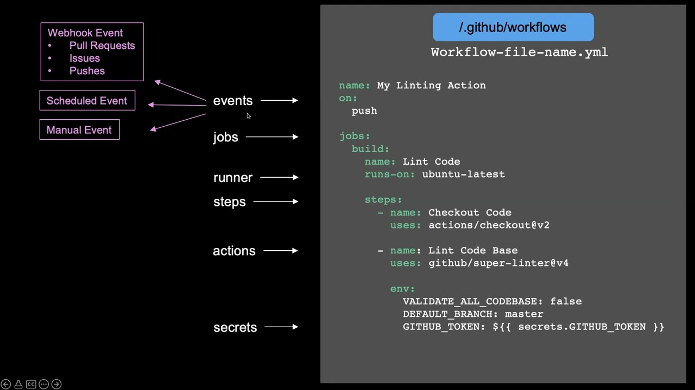

<!-- _class: lead -->

# GitHub Actions
### 3rd semester @ Erhvervsakademi København

---

## What are GitHub Actions?
- CI/CD platform integrated into GitHub
- Automate tasks within the software development lifecycle
- Trigger workflows based on events (e.g., push, pull request)
- Use predefined or custom actions
- Run jobs on GitHub-hosted or self-hosted runners

---

## What is CI/CD?
- **Continuous Integration (CI)**: Automatically build and test code changes to ensure they integrate well
- **Continuous Deployment (CD)**: Automatically deploy code changes to production or staging environments after passing tests
- Benefits: Faster development cycles, improved code quality, reduced manual errors

---

## Key Concepts
- **Workflow**: Automated process defined in a YAML file, triggered by events
- **Job**: A set of steps that execute on the same runner
- **Step**: A single task within a job, can be an action or a shell command
- **Action**: A reusable unit of code that can be shared and used in workflows

---

---

## Common used GitHub Actions

- [actions/checkout](https://github.com/actions/checkout) - Checks out your repository, so your workflow can access it.
- [actions/setup-java](https://github.com/actions/setup-java) - Sets up a specific version of Java in your GitHub Actions runner environment.
- [actions/cache](https://github.com/actions/cache) - Caches dependencies and build outputs to improve workflow execution time.
- [actions/upload-artifact](https://github.com/actions/upload-artifact) - Uploads artifacts from a workflow for later use.
- [actions/download-artifact](https://github.com/actions/download-artifact) - Downloads artifacts that were uploaded in a workflow.
- [docker/build-push-action](https://github.com/docker/build-push-action) - Builds and pushes Docker images.
- [docker/login-action](https://github.com/docker/login-action) - Logs into a Docker registry.
- [docker/metadata-action](https://github.com/docker/metadata-action) - Generates metadata for Docker images.

---

# Live Code: Build and upload JAR