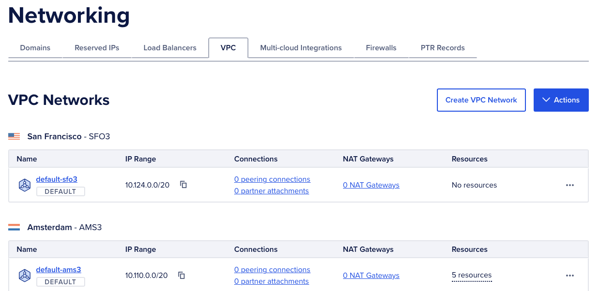
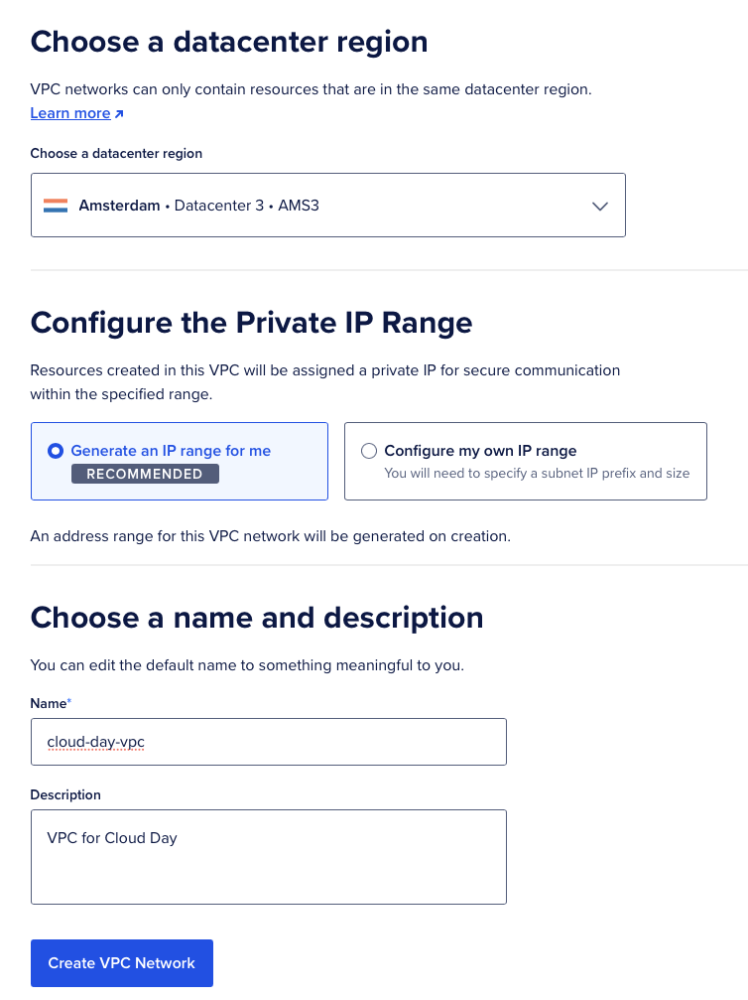
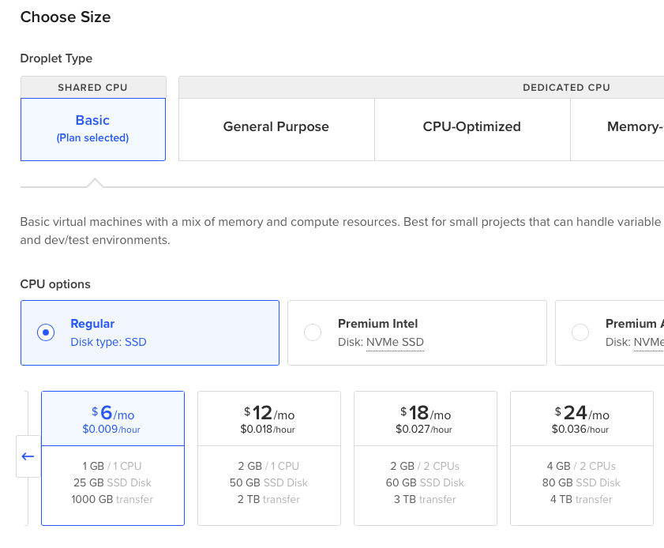

# Virtual Machines with DigitalOcean

In this exercise you will create two Virtual Machines on DigitalOcean on the same private network (VPC).

## Step 1: Creating a virtual private network

- Log in to your DigitalOcean account.
- Navigate to the "Networking" section in the left sidebar.
- Click `Create VPC Network`.
    
- Fill in the details:
    - Region: **Choose the same region where you plan to create your Droplets** (droplet == DigitalOcean VM).
        - Choose a region close to you for better latency (ie. AM3).
    - IP Range: Choose the default settings.
    - Name: `cloud-day-vpc`
    - Description (optional): `VPC for Cloud Day`
    
- Click `Create VPC Network` when done.

## Step 2: Creating two Virtual Machines (Droplets)

- Navigate to the "Droplets" section in the left sidebar.
- Click `Create Droplet`.
- Fill in the details:
    - **Region:** Select the same region as your VPC (e.g., AM3 - Amsterdam).
    - **VPC Network:** Select the VPC you created earlier (`cloud-day-vpc`).
    - **Choose an image:** Select `Ubuntu` and the latest version (e.g., 24.04).
    - **Choose a VM size:** Select Regular with 1 vCPU and 1GB RAM:
    
    - **Authentication:** Choose **SSH Key**
    - **Hostname:** `vm1`
- Click `Create Droplet` when done.

**Repeat the process to create a second Droplet with the hostname `vm2`, and choose a regular CPU with 2GB RAM and 1 vCPU.**.

## Step 3: Accessing your Virtual Machines
Once both VMs are created, you can see them listed in the "Droplets" section. 

Each VM will have a public IP address (the IP address you use to connect to it from the internet) and a private IP address (the IP address used for communication within the VPC).

On your local machine, open a terminal and connect to each VM using SSH:

```bash
ssh root@<public-ip-of-vm1>
```
Replace `<public-ip-of-vm1>` with the actual public IP address of `vm1`.


First time you connect, you may be prompted to accept the SSH key fingerprint. Type **`yes`** and press **Enter**.

## Step 4: Verify Private Network Connectivity
Once connected to `vm1`, you can ping `vm2` using its **private IP address**:

```bash
ping <private-ip-of-vm2>
```
Replace `<private-ip-of-vm2>` with the actual private IP address of `vm2`.

You should see replies from `vm2`, indicating that the two VMs can communicate over the private network. Press **`Ctrl + C`** to stop the ping command.

**Repeat step 3 and 4 to connect to `vm2` and ping `vm1` using its private IP address.**

---

## Summary
In this exercise, you created two Virtual Machines on DigitalOcean within the same private network (VPC). You accessed them via SSH and verified that they can communicate with each other using their private IP addresses. This setup is commonly used for secure communication between servers in a cloud environment.

### Why bother with a private network?
Using a private network (VPC) allows your VMs to communicate securely without exposing their private IP addresses to the public internet. This enhances security and can reduce costs associated with data transfer. Most cloud providers charge for data transfer over public IPs, while traffic within a VPC is often free.

### Security considerations
The end goal is to only have one VM exposed to the internet, while the other VM(s) are only accessible via the private network. This minimizes the attack surface and enhances security.