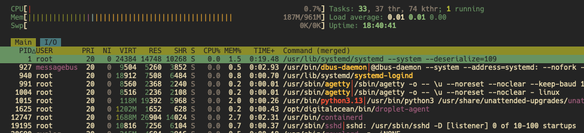

# Linux Administration Basics

In this exercise you will perform basic Linux administration tasks on a Virtual Machine (VM) running Ubuntu.

## Step 1: Connecting to your VM

1. Open a terminal on your local machine.
2. Connect to your VM using SSH:

```bash
ssh root@<public-ip-of-your-vm>
```

Replace `<public-ip-of-your-vm>` with the actual public IP address of your VM.

## Step 2: Updating the System

Once connected to your VM, the first step in any Linux administration task is to ensure the system is up to date. Run the following commands:

```bash
apt update
apt upgrade -y
```

`apt update` refreshes the package list, and `apt upgrade -y` upgrades all installed packages to their latest versions. The `-y` flag automatically confirms the upgrade. 

**apt:** Advanced Package Tool, is a package management system used by Debian-based distributions like Ubuntu to install, update, and remove software packages.

## Step 3: Installing packages

You can install new software packages using the `apt install` command. For example, to install `nginx`, run:

```bash
sudo apt install nginx -y
```

Once installed, you can check if the service is running:

```bash
systemctl status nginx
```
If it's active you should see a message indicating that the service is running:
```bash
● nginx.service - A high performance web server and a reverse proxy server
   Loaded: loaded (/lib/systemd/system/nginx.service; enabled; vendor preset: enabled)
   Active: active (running) since Mon 2025-10-10 12:34:56 UTC; 1min 30s ago
```

If it's not running, you can start it with:

```bash
sudo systemctl start nginx
```
And verify that it is running again with the `status` command.

## Step 4: Managing processes

You can view running processes using one of the following commands:
- `top`: Displays a dynamic, real-time view of running processes.
- `htop`: An enhanced version of `top` with a more user-friendly interface
- `ps aux`: Lists all running processes with detailed information.

Running the `htop` command, gives us an interactive view of processes:



From here we can see the CPU usage, Memory usage, and other details about running processes. You can use the arrow keys to navigate. Press `q` to exit `htop`.

You can also kill a process by its PID (Process ID) using the `kill` command:

```bash
kill -9 <PID>
```
Here `-9` sends a signal to forcefully terminate the process. (replace `<PID>` with the actual process ID you want to kill).

### Watching network connections
You can monitor network connections using the `netstat` command. You can install it via the `net-tools` package if it's not already installed:

```bash
sudo apt install net-tools -y
```

Then run:
```bash
netstat -atlpn
```
This shows all active internet connections along with the associated process IDs:
```bash
Proto Recv-Q Send-Q Local Address           Foreign Address         State       PID/Program name
tcp        0      0 127.0.0.53:53           0.0.0.0:*               LISTEN      22064/systemd-resol
tcp        0      0 0.0.0.0:22              0.0.0.0:*               LISTEN      1/systemd
tcp        0      0 127.0.0.54:53           0.0.0.0:*               LISTEN      22064/systemd-resol
tcp        0    372 178.62.248.129:22       83.94.142.14:57836     ESTABLISHED 22807/sshd-session:
tcp6       0      0 :::22                   :::*                    LISTEN      1/systemd
```
Line 2 and 5 show that the SSH service is listening on port 22 for both IPv4 and IPv6 connections (we will learn more about the difference between IPv4 and IPv6 later).

The option breakdown is as follows:
- `-a`: Show all connections (listening and non-listening)
- `-t`: Show TCP connections
- `-l`: Show only listening sockets
- `-p`: Show the PID and name of the program to which each socket belongs
- `-n`: Show numerical addresses instead of resolving hostnames

## Step 5: Managing Users

By default, you are provided with a root user when you create a VM. However, it's a good practice to create additional users for better security and management.

### Adding a new user
To add a new user, use the `useradd` command:
```bash
useradd -m -s /bin/bash appuser
```

This creates a user named `appuser` with a home directory (the`-m` option) and sets the default shell to `/bin/bash` (the `-s` option). You will be prompted to set a password and provide some optional information.

### Adding SSH access for the new user
Create the `.ssh` in the new user's home directory and set the correct permissions:
```bash
mkdir /home/appuser/.ssh
sudo chown -R appuser:appuser /home/appuser/.ssh
chmod 700 /home/appuser/.ssh
```

To allow the new user to access the VM via SSH, you need to copy your SSH public key to the new user's `~/.ssh/authorized_keys` file.

Exit the SSH session and run the following command on your local machine:

```bash
scp ~/.ssh/id_ed25519.pub root@<public-ip-of-your-vm>:/home/appuser/.ssh/
```
This copies over the public key file to the new user's `.ssh` directory. Replace `<public-ip-of-your-vm>` with the actual public IP address of your VM.

The `scp` command is used to securely copy files between hosts over SSH.

Then, connect back to your VM as `root` and add the public key to the `authorized_keys` file:

```bash
ssh root@<public-ip-of-your-vm>
cd /home/appuser/.ssh
cat new-key-id_ed25519.pub > authorized_keys
```
Set the correct permissions for the `.ssh` directory and `authorized_keys` file:

```bash
chown appuser:appuser /home/appuser/.ssh
chmod 700 /home/appuser/.ssh
chmod 600 /home/appuser/.ssh/authorized_keys
```
This changes the ownership of the `.ssh` directory to `appuser` and sets the appropriate permissions for the directory and file, ie. only the owner can read/write/execute.

You can now delete the copied public key file:

```bash
rm new-key-id_ed25519.pub
```

### Granting sudo privileges
To allow the new user to execute commands with superuser privileges, you need to add them to the `sudo` group:
```bash
usermod -aG sudo appuser
```
This command appends (`-a`) the user `appuser` to the group `sudo` (`-G`).

### Allow the user to use sudo without a password
To allow `appuser` to use `sudo` without being prompted for a password, you need to edit the sudoers file:
```bash
visudo
```
This opens the sudoers file in a safe editor. Add the following line at the end of the file:
```bash
appuser ALL=(ALL:ALL) NOPASSWD:ALL
```
This line allows `appuser` to execute any command as any user without being prompted for a password.

### Testing the new user
Exit the SSH session and connect as the new user:
```bash
ssh appuser@<public-ip-of-your-vm>
```

You can test if `sudo`works by running:
```bash
whoami
sudo whoami
```
It should output `appuser` for the first command and `root` for the second command.


## Step 6: Writing a bash script for automation

The steps we performed above can be automated using a bash script. Create a new file called `setup.sh` on VM2:

```bash
nano setup.sh
```

Add the following content to the file:
```bash
#!/bin/bash

# Exit immediately if a command exits with a non-zero status
set -euo pipefail

# User to be created (change as needed)
USERNAME="appuser"

# Update and install packages
apt update
apt install nginx net-tools -y
# Create a new user
useradd -m -s /bin/bash $USERNAME
# Add user to sudo group and allow passwordless sudo
usermod -aG sudo $USERNAME
echo "$USERNAME ALL=(ALL:ALL) NOPASSWD:ALL" >> /etc/sudoers

# Setup SSH directory and authorized_keys with proper permissions
mkdir -p /home/$USERNAME/.ssh
touch /home/$USERNAME/.ssh/authorized_keys
chown -R $USERNAME:$USERNAME /home/$USERNAME/.ssh
chmod 700 /home/$USERNAME/.ssh
chmod 600 /home/$USERNAME/.ssh/authorized_keys

# Print a completion message
echo "Setup completed. User '$USERNAME' created with sudo privileges."
echo "Add SSH keys to /home/$USERNAME/.ssh/authorized_keys to enable SSH access."
```

Make the script executable:
```bash
chmod +x setup.sh
```
Run the script as root:
```bash
./setup.sh
```

The only thing left to do is to add your SSH public key to the new user's `authorized_keys` file as shown in Step 5.
