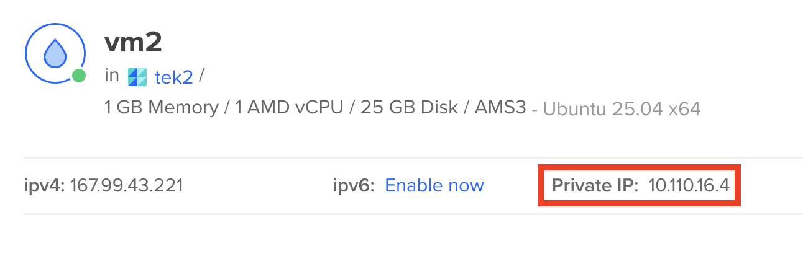

# Deployment quick guide


This guide provides a quick overview of deploying applications to cloud environments. It covers the same steps as in the previous exercises but in a more concise format for quick reference.

## Step 1: Create two VMs

Create a VPC network for your virtual machines (VMs), and name it `my-vpc`.

Create two virtual machines on DigitalOcean. Both should be in AMS3 datacenter region, and use the `my-vpc` network you created.
- VM1: 1GB RAM, 1 vCPU ~6$/month
- VM2: 2GB RAM, 1 vCPU ~12$/month


## Step 2: Creating user on the VMs

Login to `vm1`using SSH:

```bash
ssh root@<public-ip-of-vm1>
```

**Create a new user `appuser`:**

```bash
useradd -m -s /bin/bash appuser
```
**Add a password for the new user:**

```bash
passwd appuser
```
Type a password when prompted (note that the password will not be displayed on the screen).

**Create a .ssh directory for the new user:**

```bash
mkdir /home/appuser/.ssh
```

**Copy the root user's SSH public key to the new user's authorized_keys file:**

```bash
cat /root/.ssh/authorized_keys > /home/appuser/.ssh/authorized_keys
```

**Set the correct ownership and permissions:**
The `.ssh` directory and `authorized_keys` file should be owned by `appuser` and have the correct permissions set:

```bash
chown -R appuser:appuser /home/appuser/.ssh
chmod 700 /home/appuser/.ssh
chmod 600 /home/appuser/.ssh/authorized_keys
```
This changes the ownership of the `.ssh` directory to `appuser` and sets the appropriate permissions for the directory and file, ie. only the owner can read/write/execute.

**Grant sudo privileges to `appuser`:**

```bash
usermod -aG sudo appuser
```

**Allow `appuser` to use sudo without a password:**

To allow `appuser` to use `sudo` without being prompted for a password, edit the sudoers file:
```bash
visudo
```
Add the following line at the end of the file:

```
appuser ALL=(ALL) NOPASSWD:ALL
```
Exit and save the file.

**Testing the new user:**

Exit the SSH session and connect as the new user:
```bash
ssh appuser@<public-ip-of-vm1>
```
You should be able to login (assuming you have your SSH key set up correctly).


**Check sudo access:**

```bash
sudo whoami
```
This should return `root` without prompting for a password.

**Repeat the above steps to create `appuser` on `vm2`.**

### Adding a new SSH key (optional)
If you want to use a different SSH key for a user, you can generate a new key pair on your local machine and copy the public key to the VM.

**Exit the SSH session and run the following commands on your local machine.**

**Generate a new SSH key pair on your local machine:**

```bash
ssh-keygen -t ed25519 -f ~/.ssh/id_ed25519_appuser
```

**Copy the public key to the VM:**

```bash
scp ~/.ssh/id_ed25519_appuser.pub root@<public-ip-of-vm1>:/home/appuser/.ssh/
```

**Connect back to your VM as `root` and add the public key to the `authorized_keys` file:**

```bash
ssh root@<public-ip-of-vm1>
cat /home/appuser/.ssh/id_ed25519_appuser.pub >> /home/appuser/.ssh/authorized_keys
```

**Set the correct ownership and permissions again:**

```bash
chown -R appuser:appuser /home/appuser/.ssh
chmod 700 /home/appuser/.ssh
chmod 600 /home/appuser/.ssh/authorized_keys
```
**You can now delete the copied public key file:**

```bash
rm /home/appuser/.ssh/id_ed25519_appuser.pub
```

## Step 3: Setting up docker

We can follow the official Docker installation guide for [Ubuntu](https://docs.docker.com/engine/install/ubuntu/#install-using-the-repository) to install Docker on both `vm1` and `vm2`.

For now we will use this convenience script to install Docker (although it's recommended to follow the official guide as the script may not always be up to date).

**Create a script file called `install-docker.sh` on your local machine with the following content:**

```bash
#!/bin/bash

# Add Docker's official GPG key:
sudo apt-get update
sudo apt-get install ca-certificates curl
sudo install -m 0755 -d /etc/apt/keyrings
sudo curl -fsSL https://download.docker.com/linux/ubuntu/gpg -o /etc/apt/keyrings/docker.asc
sudo chmod a+r /etc/apt/keyrings/docker.asc

# Add the repository to Apt sources:
echo \
  "deb [arch=$(dpkg --print-architecture) signed-by=/etc/apt/keyrings/docker.asc] https://download.docker.com/linux/ubuntu \
  $(. /etc/os-release && echo "${UBUNTU_CODENAME:-$VERSION_CODENAME}") stable" | \
  sudo tee /etc/apt/sources.list.d/docker.list > /dev/null
sudo apt-get update

# Install the latest version
sudo apt-get install docker-ce docker-ce-cli containerd.io docker-buildx-plugin docker-compose-plugin -y
```

**Then, transfer the script to both VMs:**

```bash
scp install-docker.sh appuser@<public-ip>:/home/appuser/install-docker.sh
```

**Make the script executable and run it on each VM:**

Log into the VM:
```bash
ssh appuser@<public-ip>
```
Then run the following commands:
```bash
chmod 700 install-docker.sh
./install-docker.sh
```
Check that Docker is installed correctly by running:

```bash
sudo systemctl status docker
```
You should see that the Docker service is active and running.

**Make sure that both VMs have Docker installed and running.**

## Step 4: Running the containers

Now that Docker is installed on both VMs, we want to run the services on our virtual machines.

### VM2 - Database server

Log into `vm2`:
```bash
ssh appuser@<public-ip-of-vm2>
```

**Download the `compose.yml` file:**

```bash
wget https://raw.githubusercontent.com/ek-osnb/e25-tek2/refs/heads/main/05-cloud/exercises/scripts/db/compose.yaml -O compose.yml
```

**Download the `.env` file:**

```bash
wget https://raw.githubusercontent.com/ek-osnb/e25-tek2/refs/heads/main/05-cloud/exercises/scripts/db/.env-sample -O .env
```

**Copy the private IP address of `vm2`.**

You can find the private IP address in the DigitalOcean dashboard:


**Paste the private IP address of `vm2` into the `DB_HOST` variable in the `.env` file.**

You can use `nano` or `vim` to edit the file:
```bash
nano .env
```
Save and exit the file.

**Run the database container using Docker Compose:**

```bash
sudo docker compose up -d
```

Check that the container is running:

```bash
sudo docker ps
```

### VM1 - Application server
Log into `vm1`:
```bash
ssh appuser@<public-ip-of-vm1>
```
**Download the `compose.yml` file:**

```bash
wget https://raw.githubusercontent.com/ek-osnb/e25-tek2/refs/heads/main/05-cloud/exercises/scripts/app/compose.yaml -O compose.yml
```

**Download the `.env` file:**

```bash
wget https://raw.githubusercontent.com/ek-osnb/e25-tek2/refs/heads/main/05-cloud/exercises/scripts/app/.env-sample -O .env
```

**Paste the private IP address of `vm2` into the `DB_HOST` variable in the `.env` file.**
You can use `nano` or `vim` to edit the file:
```bash
nano .env
```
Save and exit the file.

**Run the application container using Docker Compose:**

```bash
sudo docker compose up -d
```
Check that the container is running:

```bash
sudo docker ps
```

**Test that the endpoints are working from within `vm1`:**

```bash
curl http://127.0.0.1:8080/api/hello
curl http://127.0.0.1:8080/api/books
```

## Step 5: Setting up Nginx reverse proxy on VM1

From the `compose.yml` file on `vm1`, we can see that the application is running on `127.0.0.1:8080`. This means that the application is only accessible from within `vm1`.

To make the application accessible from outside, we will set up Nginx as a reverse proxy. This will allow Nginx to listen on port 80 and forward incoming requests to the application running on port 8080.

**Log into `vm1` if you are not already logged in:**

```bash
ssh appuser@<public-ip-of-vm1>
```


**Update the apt package index and install Nginx:**

```bash
sudo apt update
sudo apt install nginx -y
```

**Make sure Nginx is running:**

```bash
sudo systemctl start nginx
sudo systemctl enable nginx
```

**Remove default Nginx configuration:**

```bash
sudo rm /etc/nginx/sites-enabled/default
```

**Create a new Nginx configuration file for the reverse proxy:**

```bash
sudo nano /etc/nginx/sites-available/reverse-proxy.conf
```
**Add the following server block to the file:**

```nginx
server {
    listen 80;
    server_name _;

    location / {
        proxy_pass http://127.0.0.1:8080;
        proxy_set_header Host $host;
        proxy_set_header X-Real-IP $remote_addr;
        proxy_set_header X-Forwarded-For $proxy_add_x_forwarded_for;
        proxy_set_header X-Forwarded-Proto $scheme;
    }
}
```
Exit and save the file.

**Enable the Nginx configuration:**

We will create a symbolic link from the `sites-available` directory to the `sites-enabled` directory to enable the reverse proxy configuration.

```bash
sudo ln -s /etc/nginx/sites-available/reverse-proxy.conf /etc/nginx/sites-enabled/reverse-proxy.conf
```

**Test the Nginx configuration for syntax errors:**

```bash
sudo nginx -t
```

You will see the following output if the configuration is correct:

```bash
nginx: the configuration file /etc/nginx/nginx.conf syntax is ok
nginx: configuration file /etc/nginx/nginx.conf test is successful
```

**Reload Nginx to apply the changes:**

```bash
sudo systemctl reload nginx
```

## Step 6: Access the application

Open a web browser and test the following urls:

```
http://<public-ip-of-vm1>/api/hello
http://<public-ip-of-vm1>/api/books
```

You should see the responses from the application.

Congratulations! You have successfully deployed a multi-tier application using Docker on cloud VMs with a reverse proxy setup.

## Step 7: Adding firewall rules
To enhance the security of your VMs, it's recommended to set up firewall rules to restrict access to only necessary ports.

We will use UFW (Uncomplicated Firewall) to set up the firewall rules on both VMs.

**By default let's deny all incoming connections and allow all outgoing connections:**

```bash
sudo ufw default deny incoming
sudo ufw default allow outgoing
```
**Allow SSH connections (port 22) on both VMs:**

```bash
sudo ufw allow 22/tcp
```
**On VM1, allow HTTP traffic (port 80) since it is the application server:**

```bash
sudo ufw allow 80/tcp
```

**Apply the firewall rules:**

```bash
sudo ufw enable
```

**Check the status of UFW to verify the rules:**

```bash
sudo ufw status verbose
```
You should see the allowed ports listed in the output.
