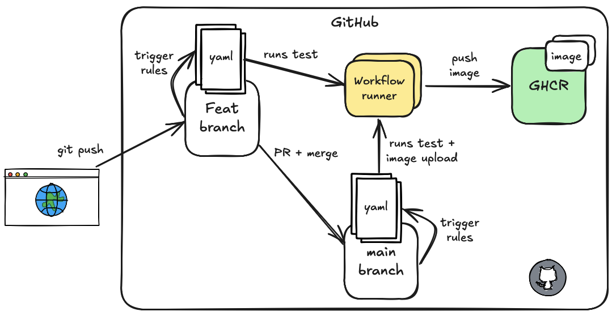
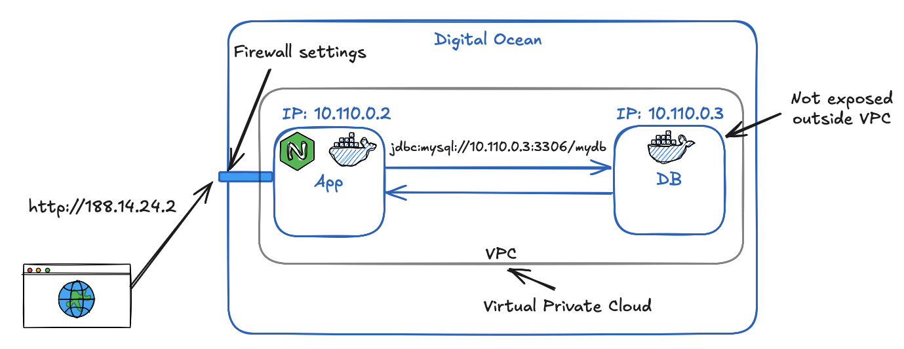
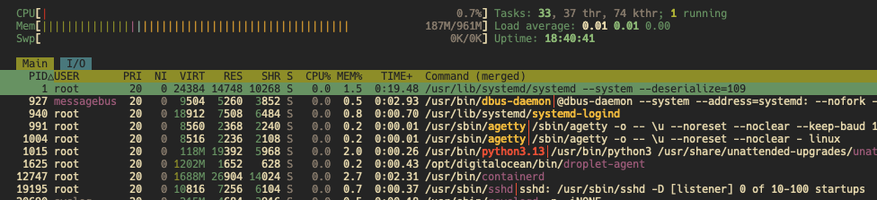
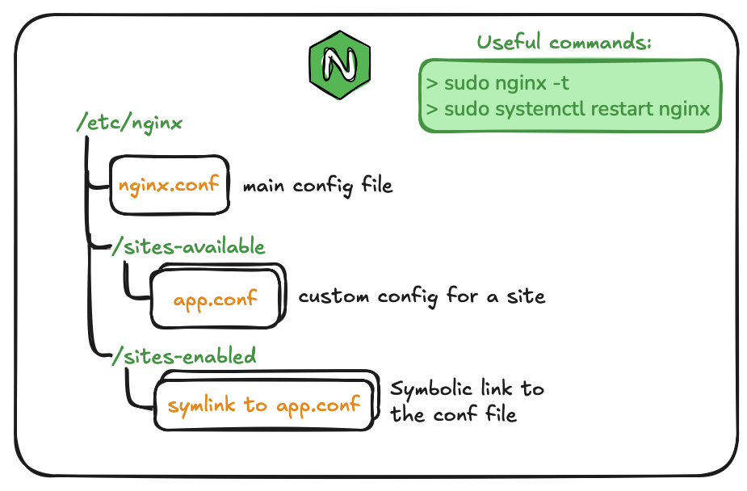
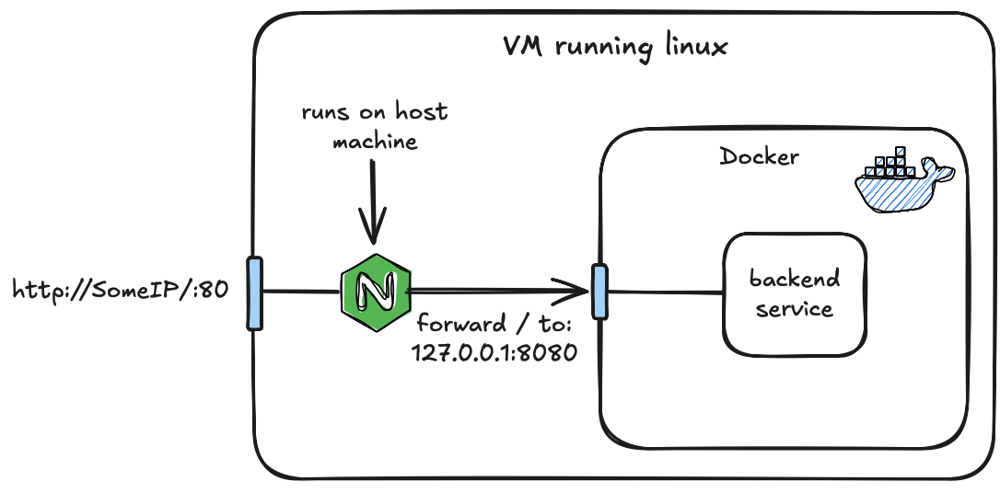
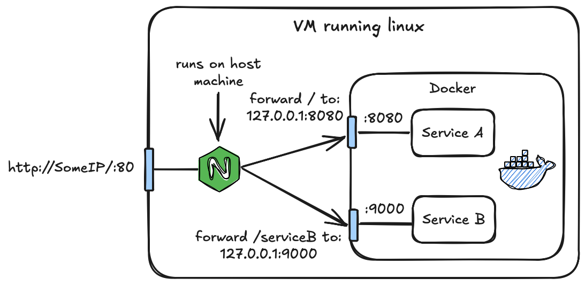

<!-- _class: lead -->

# Cloud & continuous deployment
### 3rd semester @ Erhvervsakademi København

<style>
section.lead h1 {
  text-align: center;
  font-size: 2.5em;
}
section.lead h3 {
  text-align: center;
  opacity: 0.6;
}
</style>

---

## Outline

- What is cloud?
- Different types of cloud services (IaaS, PaaS, SaaS)
- Setting up a virtual machine (VM) in the cloud
- CI/CD overview
- Using Nginx as a reverse proxy
- Common tasks when managing VM's
- Cloud exam questions


---

# What is Cloud Computing?

- Delivery of computing services over the internet (the cloud)
- Includes servers, storage, databases, networking, software, and analytics
- Provides flexibility, scalability, and cost-effectiveness
- Pay-as-you-go pricing model

---

# Types of Cloud Services

**Infrastructure as a Service (IaaS)**
- Provides virtualized computing resources over the internet
- Examples: Amazon EC2, Google Compute Engine, DigitalOcean Droplets

**Platform as a Service (PaaS)**
- Provides a platform allowing customers to develop, run, and manage applications
- Examples: Microsoft Azure App Service, DigitalOcean App Platform

**Software as a Service (SaaS)**
- Delivers software applications over the internet, on a subscription basis
- Examples: Google Docs, Microsoft 365, Dropbox etc.

---

## Cloud services

```bash
|-----------------------------|
| SaaS: You use the app       | (e.g. Google Docs)
|-----------------------------|
| PaaS: You deploy code       | (e.g. Azure App Service)
|-----------------------------|
| IaaS: You manage the OS     | (e.g. EC2, DigitalOcean Droplets)
|-----------------------------|
| On-prem: You manage all     | (your own hardware)
|-----------------------------|
```

---

# Managed vs self-managed Services

**Managed Services**
- Provider handles infrastructure, maintenance, and updates
- Tight dependency on provider
- Easier to use, less technical expertise required
- Examples: Azure App Service, DigitalOcean App Platform etc.

**Self-managed Services**
- User is responsible for setup, maintenance, and updates
- More control and flexibility
- Requires more technical expertise
- Examples: Self-hosted databases, web servers

**Question:** What are the pros and cons of each approach?

---

## Our approach

**We will use self-managed services, ie. Virtual Machines (VM's)**
- **Portability:** This allows us to stay somewhat provider agnostic (we can easily switch providers if needed)
- **Learning experience:** Setting up and managing our own VM's gives us a deeper understanding of cloud infrastructure and operations
- **Flexibility:** We have full control over the software and configurations on our VM's
- **Cost-effective:** VM's are generally cheaper than managed services

**Downside: More responsibility for maintenance and security**

---

# CI/CD

**CI** = Continuous Integration
- Developers merge their code changes into a shared repository frequently (multiple times a day).
- Automated tests are run to ensure that new changes do not break existing functionality.
- CI helps catch issues early in the development process.

**CD** = Continuous Delivery
- Continuous Delivery ensures that code changes are automatically prepared for a production release.

---

## Are we fully doing full CI/CD?

<!-- **CI**
- We run tests on every push to the repository.
- We build our Docker images automatically as part of the CI process.
- Code quality checks are also part of CI, but have not implemented this.

**CD**
- We do partial CD: We build and push Docker images to GHCR automatically.
- We are missing automatic deployment to our VM's - **We will do this manually in this course.**

--- -->



---

## Are we fully doing full CI/CD?

**CI**
- We run tests on every push to the repository.
- We build our Docker images automatically as part of the CI process.
- Code quality checks are also part of CI, but have not implemented this.

**CD**
- We do partial CD: We build and push Docker images to GHCR automatically.
- We are missing automatic deployment to our VM's (out of scope for this course).

---

# Cloud infrastructure for our projects



---

## Explanation

1. The client (browser) makes a request to the public IP address of our VM.
2. The firewall settings ensure that only HTTP/HTTPS traffic is allowed to reach the VM.
3. The App VM contains our web application running in containers. Nginx acts as a reverse proxy, forwarding requests to the appropriate container based on the URL.
4. The Database VM hosts our database server, which is only accessible from the App VM for security reasons.

**VPC** = Virtual Private Cloud (isolated network within the cloud provider). We control access via firewall rules.

---

# Demo: Provisioning VM's on DigitalOcean
- GUI way
- Using DigitalOcean API

---

# Exercises 01: Provisioning VM's on DigitalOcean

---
# Linux admin tasks for cloud VM's

When we provision a VM in the cloud, we typically get a basic Linux installation with SSH access. But we need to perform several administrative tasks to set up and manage the VM effectively.

- Installing software (e.g., Docker, Nginx)
- Monitoring resource usage (CPU, memory, disk space)
- Adding and managing users including SSH keys
- Setting up dockerized applications
- Configuring firewall rules (e.g., allow HTTP traffic)

---

## Installing software on ubuntu

Ubuntu uses the `apt` package manager for installing and managing software packages.

```bash
# Update package lists
sudo apt update

# Upgrade installed packages
sudo apt upgrade -y

# Install nginx
sudo apt install nginx -y
```

**Question:** Why do we run `apt update` before `apt upgrade`?

---

## Monitoring resource usage

Use commands like `top` or `htop` to monitor CPU and memory usage in real-time.



**Question:** What would you do if your VM is running out of memory?

---

## User management and security

- The VM comes with a default user (e.g., `root` or `ubuntu`).

- But it is good practice to create users with limited privileges for daily tasks.

- Docker automatically creates a `docker` group, which allows users in that group to run Docker commands without `sudo`.

---

## Adding a new user

```bash
# Add a new user with shell and home dir
sudo useradd -s /bin/bash -m appuser

# Add user to the sudo group
sudo usermod -aG sudo appuser
```
At the moment it does not have access over SSH. We will add the SSH key:
```bash
sudo mkdir /home/appuser/.ssh
sudo nano /home/appuser/.ssh/authorized_keys # paste public key here
sudo chown -R appuser:appuser /home/appuser/.ssh
sudo chmod 700 /home/appuser/.ssh
sudo chmod 600 /home/appuser/.ssh/authorized_keys
```
**Question:** Why do we set specific permissions on the `.ssh` directory and `authorized_keys` file?

---

## bash scripts

**A bash script is a text file containing a series of commands that can be executed in sequence.**

The `#!/bin/bash` (shebang) at the top indicates that the script should be run using the bash shell.

```bash
#!/bin/bash

name="OSNB" # variable
echo "Hello, $name!"
```

We can make the script executable and run it:
```bash
chmod +x script.sh
./script.sh
```

---


## Configuring firewall with ufw

**A firewall helps protect the VM by controlling incoming and outgoing network traffic based on predefined security rules.**

We use ufw (Uncomplicated Firewall) which is a user-friendly interface for managing firewall rules on Ubuntu.

```bash
# Check status of ufw
sudo ufw status

# Allow HTTP connections
sudo ufw allow http

# Enable the firewall
sudo ufw enable
```
**Question:** Why is it important to allow SSH before enabling the firewall?

---

# Exercises 02+03: linux admin tasks & docker setup

---


# Nginx as a reverse proxy
- Nginx is a popular web server that can be used to serve static content, handle load balancing, and act as a reverse proxy.

- **Reverse Proxy**
    - A reverse proxy forwards client requests to backend servers.

**Note we are not going to dockerize the nginx server, but run it directly on the VM (simplifies adding HTTPS later).**

---

# Nginx reverse proxy

The following is a config file for Nginx as a reverse proxy:
```nginx
# app.conf
server {
    listen 80;
    server_name _; # catch all

    location / {
        proxy_pass http://127.0.0.1:8080; # forward to Spring container
        # Forward client info to the backend service
        proxy_set_header Host $host;
        proxy_set_header X-Real-IP $remote_addr;
        proxy_set_header X-Forwarded-For $proxy_add_x_forwarded_for;
        proxy_set_header X-Forwarded-Proto $scheme;
    }
}
```

---

# Nginx file locations

- Main config file: `/etc/nginx/nginx.conf`
- Site-specific config files: `/etc/nginx/sites-available/` and `/etc/nginx/sites-enabled/`
- Log files: `/var/log/nginx/access.log` and `/var/log/nginx/error.log`

- Test config: `sudo nginx -t`
- Restart Nginx: `sudo systemctl restart nginx`

---



---
# nginx reverse proxy



---

# nginx reverse proxy with multiple services



---

# Demo: Setting up Nginx

---

# Exercises 04+05: Setting up Nginx + firewall

---

# Exercise 06: VM1 to VM2 Communication over SSH

---

**Eksempler på spørgsmål:**
1. Hvad er forskellen på IaaS, PaaS og SaaS?
2. Hvad er fordelene og ulemperne ved at bruge en managed service vs en self-managed service?
3. Hvordan deployer man en statisk hjemmeside i cloud?
4. Hvordan deployer man en Spring Boot applikation i cloud?
5. Hvordan kan ens Docker port-konfiguration påvirke sikkerheden?

**Eksempler på demonstration:**
1. Vis “CD”-delen af et GitHub Actions-workflow for et projekt
2. Vis hvordan man provisionerer en VM på en cloud
3. Vis hvordan man ændrer firewall-regler for en cloud VM
4. Vis hvordan man logger ind på en cloud VM
