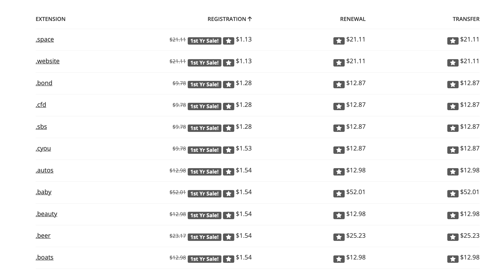
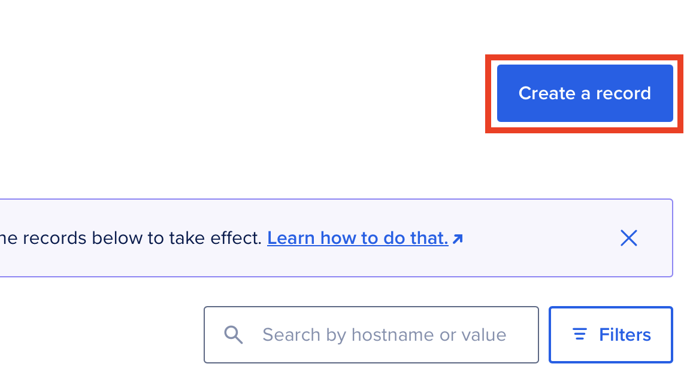

# Buying a domain and setting up DNS records

In this exercise, you will purchase a domain name from a domain registrar and configure DNS records to point to a web server.

Since this exercise involves purchasing a domain, it is optional.

There exist several domain registrars where you can buy domain names, such as simply.com, one.com, namecheap.com, porkbun.com etc. Some registrars offer discounts for the first year: namecheap.com, porkbun.com.

**Note:** We will use DigitalOcean's DNS management service to manage DNS records. You can also use the DNS management service provided by your domain registrar, but the steps may vary from registrar to registrar. So by using DigitalOcean's DNS management service, we can have a consistent experience, no matter which domain registrar you use.

## Domain registrars

**Make sure to disable auto-renewal when purchasing a domain, as the regular price after the first year can be significantly higher than the initial price.**

### Using Porkbun as the domain registrar

Porkbun is another affordable domain registrar that offers competitive pricing and a user-friendly interface. They often have promotions for new customers.

To see a list of available top-level domains (TLDs) and their prices, visit [Porkbun's TLD list](https://porkbun.com/products/domains).

---

### Using Namecheap as the domain registrar

GitHub Student Developers Pack offers a free domain for one year through Namecheap. You can use it to get a free domain. To use this, visit [GitHub Education](https://education.github.com/experiences/virtual_event_kit), and scroll down to the Namecheap section to claim your free domain.

They offer `.online` domains for around $1 for the first year - without GH Student Developer Pack.

- [Adding A-record with namecheap](https://www.namecheap.com/support/knowledgebase/article.aspx/319/2237/how-can-i-set-up-an-a-address-record-for-my-domain/)

- [Creating CNAME record with namecheap](https://www.namecheap.com/support/knowledgebase/article.aspx/9646/2237/how-to-create-a-cname-record-for-your-domain/)

---

## Using DigitalOcean as the DNS management service

**1. Go to the [DigitalOcean Networking & DNS page](https://cloud.digitalocean.com/networking/domains).**

**2. Click on `Add Domain`.**

**3. Enter your purchased domain name in the `Enter Domain` field.**

This creates `NS` records for DigitalOcean's nameservers:
- `ns1.digitalocean.com`
- `ns2.digitalocean.com`
- `ns3.digitalocean.com`

**4. Login to your domain registrar's website and navigate to the DNS settings for your domain.**

**5. Update the nameservers to point to DigitalOcean's nameservers listed above.**

**6. Save the changes.**

**Note:** DNS changes can take time to propagate throughout the internet due to caching at various levels (local DNS resolver, ISP, etc.). The time it takes for DNS changes to propagate can vary based on the TTL (Time To Live) settings of the DNS records. Lower TTL values can lead to faster propagation but may increase the load on DNS servers. It's common to wait anywhere from a few minutes to 48 hours for DNS changes to fully propagate.

---

## Adding DNS records in DigitalOcean

We want to create an `A` record to point our domain to the public IP address of our web server, and a `CNAME` record to point a subdomain (`www`) to our main domain.

**1. Go to the [DigitalOcean Networking & DNS page](https://cloud.digitalocean.com/networking/domains).**

Click on your domain name to manage its DNS records.

**2. Add a new DNS record.**

Click on the "Create a Record" button to create a new DNS record:

**3. Create an A record.**
- **Record type:** A
- **Hostname:** @
- **Will Direct To:** Your server's public IP address
- **TTL:** Default (3600 seconds)

Click `Create Record` to save the A record.

**4. Create a CNAME record.**
- **Record type:** CNAME
- **Hostname:** www
- **Is an alias of:** yourdomain.com (replace with `@`)
- **TTL:** Default (43200 seconds)

Click `Create Record` to save the CNAME record.

**5. Verify the DNS records.**

You can use tools like [DNS Checker](https://dnschecker.org/) to verify that your DNS records have propagated correctly. Enter your domain name and check the A and CNAME records.

