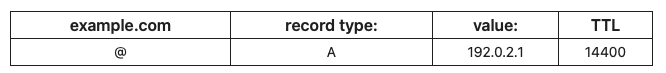
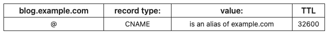
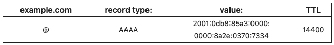
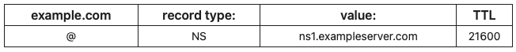
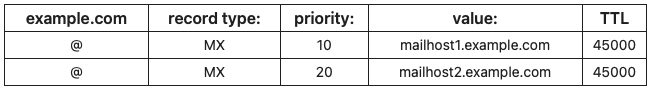
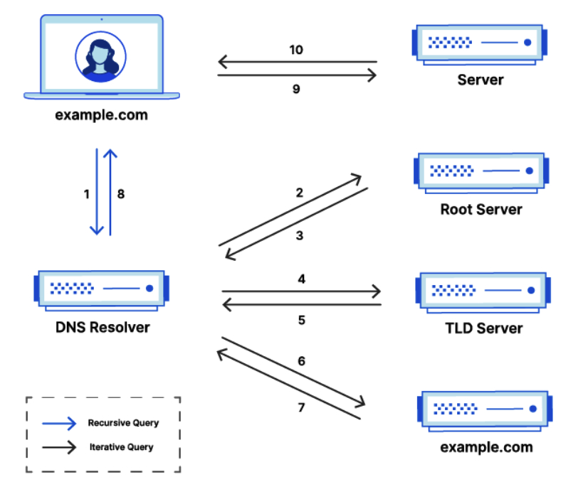
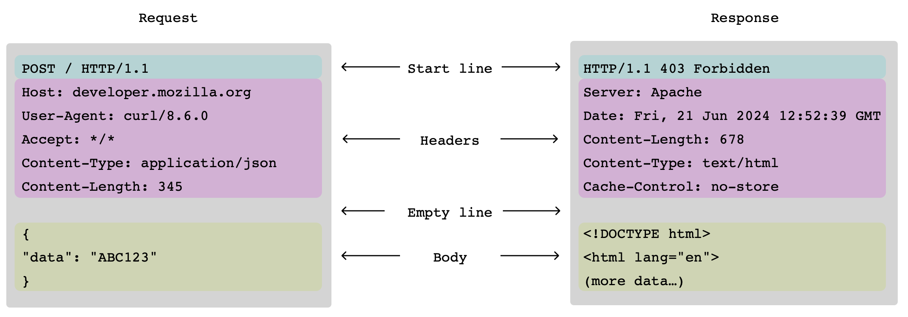
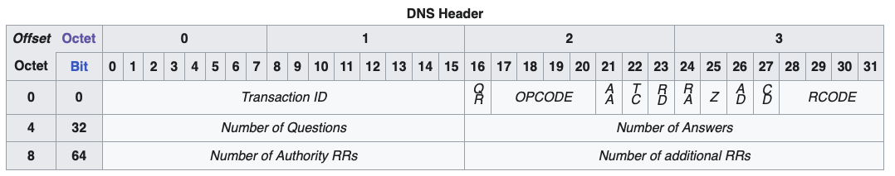

<!-- _class: lead -->

# DNS & HTTP
### 3rd semester @ Erhvervsakademi København

<style>
section.lead h1 {
  text-align: center;
  font-size: 2.5em;
}
section.lead h3 {
  text-align: center;
  opacity: 0.6;
}
</style>

---

# Outline
- What is DNS?
- IP Addresses & Hostnames
- DNS Records
- Common DNS Queries
- Hierarchical Structure of DNS
- DNS Servers: Recursive & Authoritative
- Practical Example
- Intro to Wireshark
- Intro to OSI model
- HTTP in Wireshark

---

## Why DNS?

- When you type a URL into your web browser, such as `www.ek.dk`, your computer needs to find the corresponding IP address to connect to the web server hosting that site.
- **DNS (Domain Name System)** is like the phonebook of the internet, translating **human-friendly domain names** into machine-friendly **IP addresses**.

---

## IP Addresses & Hostnames

- **Host name**: **`www.ek.dk`**
A human-readable label that is assigned to a device connected to a network. Hostnames are easier to remember than IP addresses.
    - Domain: **`ek.dk`**
    - Subdomain: **`www`**
    - Top-Level Domain (TLD): **`.dk`**

- **IP Address**: **20.50.2.66**
A unique string of numbers separated by periods (IPv4) that identifies each computer using the Internet Protocol to communicate over a network.

---

## IP Addresses

**IPv4**: 
32-bit (4 bytes) address, written as four decimal numbers separated by dots:
```bash
      20 .      50  .        2 .       66
00010100 . 00110010 . 00000010 . 01000010
```
- Has a limited address space (about 4.3 billion addresses).

**IPv6**:
128-bit (16 bytes) address, written as eight groups of four **hexadecimal** digits separated by colons:
```bash
2001:0db8:85a3:0000:0000:8a2e:0370:7334
```
- Vastly larger address space (about `3.4 x 10^38` addresses).

---
## IP Address Space
**IPv4**:
- Approximately 4.3 billion addresses (2^32).
- The range of IP addresses is from `0.0.0.0` to `255.255.255.255`.
- But many are reserved for a special purpose:
    - Private networks: (e.g., `192.168.x.x`, `10.x.x.x`, `172.16.x.x` to `172.31.x.x`)
    - Multicast addresses: (e.g., `224.0.0.0` to `239.255.255.255`)
    - Loopback addresses: (e.g., `127.0.0.1`)

---

## Why separate Names and IP Addresses?

- **Memorability**: Domain names are easier for humans to remember than numerical IP addresses.
    - `www.ek.dk` vs `20.50.2.66`
- **Flexibility**: IP addresses can change (e.g., when a website moves to a different server), but the domain name can remain the same.
    - Moving `www.ek.dk` to a new IP address doesn't require users to learn a new address.
- **Scalability**: A single domain name can point to multiple IP addresses (e.g., for load balancing or redundancy).
    - `www.ek.dk` can resolve to multiple servers to handle more traffic.
- **Multiple aliases**:
    - `www.ek.dk`, `ek.dk` point to the same IP address.

---

## Domain Name System (DNS)

**Problem:** How do we translate domain names to IP addresses?

**Solution:** The Domain Name System (DNS) is a hierarchical system that maps domain names to IP addresses.

---

## First approach: Centralized server

- A single server that maintains a database of domain names and their corresponding IP addresses.
- When a user wants to access a website, their computer queries this central server to get the IP address.
- All queries go to this one server.

**Question:** What are the potential issues with this approach?

---

## Domain Name System (DNS)

- Instead of a centralized server, DNS uses a **distributed** and **hierarchical** approach.
- DNS is made up of many servers around the world, each responsible for different parts of the domain name space.
- When a user wants to access a website, their computer queries multiple DNS servers in a **hierarchical** manner to resolve the domain name to an IP address.

---

## Hierarchical Structure of DNS
**DNS hierarchy is organized in levels:**
- **Root Level**: The top level, represented by a dot `.`.
- **Top-Level Domains (TLDs)**: Below the root, such as `.com`, `.org`, `.net`, and country-code TLDs like `.dk`, `.uk`, `.jp`.
- **Authoritative Servers**: Each TLD has authoritative servers that manage the next level down, which includes second-level domains (e.g., `ek` in `ek.dk`).

<!-- _class: img-60 -->


<style>
  section.img-60 img {
    max-width: 60%;
    height: auto;
    display: block;
    margin: 0 auto;
  }
</style>


---

## Root nameservers
- As of today (2025), there are 1994 root servers worldwide, operated by 12 organizations.
- There are 13 root server addresses, labeled A through M, but each address can correspond to multiple physical servers.


---

## DNS Resolution Process

- When you type a URL into your browser, your computer initiates a **DNS query** to resolve the domain name to an IP address.


---

## The 8 steps in a DNS lookup
1. Your computer asks a **recursive resolver** (usually provided by your ISP or a public DNS service like Google DNS or Cloudflare DNS) to resolve the domain name.
2. The recursive resolver asks a **root nameserver** for the TLD (e.g., `.dk`).
3. The root nameserver responds with the address of a **TLD nameserver** for `.dk`.
4. The recursive resolver then asks the TLD nameserver for the domain (e.g., `ek.dk`).
5. The TLD nameserver responds with the address of the **authoritative nameserver** for `ek.dk`.
6. Finally, the recursive resolver asks the authoritative nameserver for the IP address of `www.ek.dk`.
7. The authoritative nameserver responds with the IP address (e.g., `20.50.2.66`).
8. The recursive resolver returns this IP address to your computer.

---

## Recursive vs. iterative queries

- **Recursive query**: It puts the burden of resolution on the DNS server. The server will query other servers on behalf of the client until it finds the answer or an error.
- **Iterative query**: The DNS server responds with the best answer it can provide based on its knowledge. If it doesn't know the answer, it will refer the client to another DNS server.

**Question:** Identify which steps in the DNS resolution process are recursive and which are iterative.

---

## Recursive vs authoritative resolvers

A **resolver** is a DNS client that initiates the DNS query process on behalf of the user.

- A **recursive resolver** (or DNS resolver) is responsible for handling the entire DNS resolution process, querying multiple DNS servers as needed to obtain the final IP address.

- An **authoritative resolver** (or authoritative nameserver) is a DNS server that holds the definitive records for a specific domain. It responds to queries about that domain with the actual IP addresses and other DNS records.

---

## DNS caching

- To improve efficiency and reduce latency, **DNS responses are often cached at various levels** (e.g., on your computer, by your ISP, or by the recursive resolver).

- Cached entries have a **Time To Live (TTL)** value, which indicates how long the entry should be kept before it is considered stale and needs to be refreshed.

- **Negative caching** is also used to store information about failed lookups, preventing repeated queries for non-existent domains.

---

## DNS records

- **A Record**: Maps a domain name to an **IPv4 address**.
- **AAAA Record**: Maps a domain name to an **IPv6 address**.
- **CNAME Record**: Canonical Name record, used to alias one domain name to another. E.g., `www.kea.dk` to `kea.dk`.
- **MX Record**: Mail Exchange record, specifies the mail server responsible for receiving email on behalf of a domain.
- **TXT Record**: Text record, used to store arbitrary text data, often for verification purposes (e.g., SPF records for email).
- **NS Record**: Name Server record, indicates which DNS server is authoritative for a particular domain.

---

**A Record example:**


**CNAME Record example:**


**AAAA Record example:**


**NS Record example:**


**MX Record example:**


---

## DNS lookup tools

**MacOS/Linux:**
- `nslookup`
- `dig`
- `host`

**Windows:**
- `nslookup`
- `dig` using a Docker container.

---

# `dig` command

**MAC:**
Use Homebrew (a package manager for macOS - can be installed from https://brew.sh/):
```bash
# Use homebrew to install bind (which includes dig):
brew install bind
```
**Windows:**
Use docker interactively:
```bash
docker run -it jonlabelle/network-tools bash
# If you get an error: the input device is not a TTY, use:
winpty docker run -it jonlabelle/network-tools bash
```

---

## Practical Example: Using `dig`

```bash
$ dig ek.dk
; <<>> DiG 9.10.6 <<>> ek.dk
;; global options: +cmd
;; Got answer:
;; ->>HEADER<<- opcode: QUERY, status: NOERROR, id: 60213
;; flags: qr rd ra; QUERY: 1, ANSWER: 1, AUTHORITY: 0, ADDITIONAL: 1

;; OPT PSEUDOSECTION:
; EDNS: version: 0, flags:; udp: 1232
;; QUESTION SECTION:
;ek.dk.				IN	A

;; ANSWER SECTION:
ek.dk.			600	IN	A	20.50.2.66

;; Query time: 24 msec
;; SERVER: 192.168.0.1#53(192.168.0.1)
;; WHEN: Tue Oct 14 14:47:30 CEST 2025
;; MSG SIZE  rcvd: 50
```

---

## Practical Example: Using `dig +trace`
Shows path from **root servers** down to the **authoritative server** for the domain.

```bash
$ dig +trace ek.dk
; <<>> DiG 9.10.6 <<>> +trace ek.dk
;; global options: +cmd
.			242548	IN	NS	m.root-servers.net.
.			242548	IN	NS	e.root-servers.net.
.			242548	IN	NS	c.root-servers.net.
.			242548	IN	NS	j.root-servers.net.
.			242548	IN	NS	b.root-servers.net.
.			242548	IN	NS	h.root-servers.net.
.			242548	IN	NS	f.root-servers.net.
.			242548	IN	NS	l.root-servers.net.
.			242548	IN	NS	d.root-servers.net.
.			242548	IN	NS	i.root-servers.net.
.			242548	IN	NS	k.root-servers.net.
.			242548	IN	NS	a.root-servers.net.
.			242548	IN	NS	g.root-servers.net.
```
---

<!-- ## Practical Example: Using `dig +trace` continued -->

```bash
;; Received 1109 bytes from 192.168.0.1#53(192.168.0.1) in 21 ms

dk.			172800	IN	NS	b.nic.dk.
dk.			172800	IN	NS	c.nic.dk.
dk.			172800	IN	NS	h.nic.dk.
dk.			172800	IN	NS	l.nic.dk.
dk.			172800	IN	NS	s.nic.dk.
dk.			172800	IN	NS	t.nic.dk.
```
---

<!-- ## Practical Example: Using `dig +trace` continued -->

```bash
;; Received 733 bytes from 170.247.170.2#53(b.root-servers.net) in 29 ms

ek.dk.			86400	IN	NS	ns.efif.dk.
ek.dk.			86400	IN	NS	ns2.efif.dk.
ek.dk.			86400	IN	NS	ns3.efif.dk.

;; Received 366 bytes from 194.0.28.7#53(s.nic.dk) in 23 ms

ek.dk.			600	IN	A	20.50.2.66
```
- The result is the IP address of `ek.dk`: `20.50.2.66`.

**Questions:** What is the TTL and which record types are returned?

---

## `dig +trace` explanation

When using `dig +trace`, you can see the entire resolution path from the root servers down to the authoritative server for the domain.

- This is actually a *"hack"* because `dig` is performing the iterative queries on your behalf, simulating what a recursive resolver would do.

---

## Exercise: DNS Lookup

1. Use **`nslookup`** to find the IP address of `ek.dk`.
2. Use **`dig`** to perform a DNS query for `ek.dk` and try different query types (A, AAAA, MX, etc.).
3. Use **`dig +trace ek.dk`** to see the full resolution path from the root servers down to the authoritative server.
    - Which servers were contacted?
    - Identify the root, TLD and authoritative servers.
    - Do it repeatedly what happens to the results?

---

## Inserting records into DNS

- DNS records are typically managed by the domain owner through a DNS hosting provider or registrar.
- Changes to DNS records (like adding an A record or MX record) are made through a web interface or API provided by the DNS hosting service.
- Once changes are made, they need to propagate through the DNS system, which can take time due to caching and TTL values.
- The TTL (Time To Live) value determines how long a DNS record is cached by resolvers before they must query the authoritative server again for updated information.

---

## Security Considerations
- **DNS Spoofing/Cache Poisoning**: Attackers can manipulate DNS responses to redirect users to malicious sites.
- **DNSSEC (DNS Security Extensions)**: A suite of extensions that add a layer of security to DNS by enabling DNS responses to be verified for authenticity.
- **Privacy Concerns**: DNS queries can reveal browsing habits; using encrypted DNS (like DNS over HTTPS or DNS over TLS) can help mitigate this.
- **DDoS Attacks**: DNS servers can be targeted in Distributed Denial of Service attacks, overwhelming them with traffic and making them unavailable.

---

# DEMO: Registering a domain and setting up DNS records
- Register a domain through a registrar (simply.com, one.com, etc.).
- Use the registrar's DNS management tools to add records:
    - Add an A record to point `yourdomain.com` to your server's IP address.
    - Add a CNAME record for `www.yourdomain.com` to point to `yourdomain.com`.
- We need a web server to respond to HTTP requests.

---

## Exercise: Setting up DNS records
1. Register a domain name through a registrar (e.g., simply.com, one.com).
2. Use the registrar's DNS management tools to add the following records:
    - An A record to point `yourdomain.com` to a public IP address (you can use a placeholder IP if you don't have one).
    - A CNAME record for `www.yourdomain.com` to point to `yourdomain.com`.
3. Use `dig` or `nslookup` to verify that the records have been added correctly.

---

# DNS propagation time

- DNS changes can take time to propagate throughout the internet due to caching at various levels (local DNS resolver, ISP, etc.).
- The time it takes for DNS changes to propagate can vary based on the TTL (Time To Live) settings of the DNS records.
- Lower TTL values can lead to faster propagation but may increase the load on DNS servers.
- It's common to wait anywhere from a few minutes to 48 hours for DNS changes to fully propagate.

**See a visualization of DNS propagation at https://dnschecker.org/**

---

# Adding TLS to a nginx server

When hosting a website, it's important to secure the connection using SSL/TLS. This ensures that data transmitted between the user's browser and the web server is **encrypted**.
- Encryption protects the data from being intercepted by malicious actors.

- TLS also provides **authentication**, ensuring that users are connecting to the legitimate website and not an imposter.


---

# Practical Example: Using Let's Encrypt with Nginx

1. On the VM hosting your Nginx server, install Certbot:
    ```bash
    sudo apt-get update
    sudo apt-get install certbot python3-certbot-nginx
    ```
2. Obtain an TLS certificate for your domain:
    ```bash
    sudo certbot --nginx -d yourdomain.com -d www.yourdomain.com
    ```
3. Follow the prompts to complete the certificate installation.
4. Certbot will automatically configure Nginx to use the new TLS certificate.

**Replace `yourdomain.com` with your actual domain name.**


---

# Exercise: Setting up TLS with Let's Encrypt

---

## Using Digital Oceans DNS management
**Why change DNS providers?**
- Centralized management for multiple domains.
- Easy to update records.
- Reliable DNS hosting.
- Digital Ocean exposes a simple UI and **REST API** for managing DNS records.
- It's free to use if you have a Digital Ocean account.

---

# DNS & HTTP

Once the DNS resolution is complete and you have the IP address of the web server, your browser can establish a connection to the server using the **HTTP (Hypertext Transfer Protocol)** to request and receive web pages.

---



---

# HTTP

HTTP is a text-based protocol used for communication between clients (like web browsers) and servers. It consists of **requests** sent by the client and **responses** sent by the server.

HTTP defines how messages are formatted and transmitted, and how web servers and browsers should respond to various commands.

HTTP is **stateless**, meaning each request from a client to a server is independent and unrelated to previous requests.

---

## Structure of an HTTP request

```http
GET /books HTTP/1.1
Host: www.example.com
User-Agent: curl/8.7.1
Accept: application/json

```

---

## Structure of an HTTP response

```http
HTTP/1.1 200 OK
Content-Type: application/json
Content-Length: 85

{
  "books": [
    {"id": 1, "title": "1984", "author": "George Orwell"},
    {"id": 2, "title": "To Kill a Mockingbird", "author": "Harper Lee"}
    ]
}
```

---

## General HTTP structure

```bash
+---------------------------------------+
| Start Line (req) or Status Line (res) | <- Method, Path, Version or Version, Status Code
+---------------------------------------+
| Headers                               | <- Key-Value pairs
+---------------------------------------+
| Blank Line                            | <- CRLF to indicate end of headers
+---------------------------------------+
| Body (optional)                       | <- Body content
+---------------------------------------+
```

**Question:**
- How does it now how long the status line and headers are?
- What separates the headers from the body?

---
## HTTP line endings

- It uses the CRLF (Carriage Return Line Feed) sequence to indicate the end of each line, and a blank line (CRLF CRLF) to indicate the end of the headers section.
- CR = Carriage Return (ASCII 13) or `\r` - `0x0D` in hex
- LF = Line Feed (ASCII 10) or `\n` - `0x0A` in hex

---

## HTTP Line endings example

```http
GET /books HTTP/1.1\r\n
Host: www.example.com\r\n
User-Agent: curl/8.7.1\r\n
Accept: application/json\r\n
\r\n
```

---

# HTTP Versions

- HTTP/0.9 is an early version and is largely obsolete.
- HTTP/1.0 (see [RFC 1945](https://tools.ietf.org/html/rfc1945)) - introduced the concept of headers and the ability to specify the type of content being sent.
- HTTP/1.1 (see [RFC 7230](https://tools.ietf.org/html/rfc7230)) - improved performance and introduced persistent connections.
- HTTP/2 (see [RFC 7540](https://tools.ietf.org/html/rfc7540)) - introduced multiplexing (= multiple requests in one connection) and header compression.
- HTTP/3 (see [RFC 9114](https://tools.ietf.org/html/rfc9114)) - built on QUIC for improved performance.

**We will focus on HTTP/1.1 for this course.**

---

## HTTP methods
- **GET**: Requests data from a specified resource. (e.g., loading a webpage)
- **POST**: Submits data to be processed to a specified resource. (e.g., submitting a form)
- **PUT**: Updates a current resource with new data.
- **DELETE**: Deletes the specified resource.
- **HEAD**: Similar to GET but only requests the headers, not the body.
- **OPTIONS**: Describes the communication options for the target resource.

---

## HTTP Status Codes
- **1xx (Informational)**: Request received, continuing process.
- **2xx (Success)**: The request was successfully received, understood, and accepted.
    - `200 OK`: The request has succeeded.
- **3xx (Redirection)**: Further action needs to be taken to complete the request.
    - `301 Moved Permanently`: The resource has been moved to a new URL.
    - `302 Found`: The resource is temporarily located at a different URL.
- **4xx (Client Error)**: The request contains bad syntax or cannot be fulfilled.
    - `404 Not Found`: The requested resource could not be found.
    - `403 Forbidden`: The server understood the request but refuses to authorize it.
- **5xx (Server Error)**: The server failed to fulfill a valid request.
    - `500 Internal Server Error`: A generic error message when the server encounters an unexpected condition.
    - `502 Bad Gateway`: The server received an invalid response from the upstream server.

---

## HTTP headers
- HTTP headers are key-value pairs sent between the client and server to provide additional information about the request or response.
- Common request headers:
    - `Host`: Specifies the domain name of the server (e.g., `www.ek.dk`).
    - `Accept`: Specifies the media types that the client can process (e.g., `text/html`, `application/json`).
- Common response headers:
    - `Content-Type`: Indicates the media type of the resource (e.g., `text/html`).
    - `Content-Length`: The size of the response body in bytes.

---

## HTTP format example

<!-- _class: img-100 -->



<style>
  section.img-100 img {
    max-width: 100%;
    height: auto;
    display: block;
    margin: 0 auto;
  }
</style>

---

# HTTPS

- HTTPS (Hypertext Transfer Protocol Secure) is the secure version of HTTP.
- Builds on HTTP by adding a layer of encryption using SSL/TLS (Secure Sockets Layer / Transport Layer Security).
- Ensures that data transmitted between the client and server is encrypted and secure from eavesdropping or tampering.
- HTTPS uses port 443 by default, while HTTP uses port 80.

---

# OSI vs TCP/IP Model

When learning about networking, two common models are used to describe how data is transmitted over a network: the **OSI (Open Systems Interconnection)** model and the **TCP/IP (Transmission Control Protocol/Internet Protocol)** model.

- The OSI model has 7 layers, while the TCP/IP model has 4 layers.
- The TCP/IP model is more practical and widely used in real-world networking.


---

## OSI Model Overview 
The OSI (Open Systems Interconnection) model is a conceptual framework used to understand and implement network protocols in seven layers.

**1. Physical Layer:** Deals with the physical connection between devices (e.g., cables, switches).
**2. Data Link Layer:** Manages data frames between devices on the same network (e.g., Ethernet, MAC addresses).
**3. Network Layer:** Handles routing of data packets across networks (e.g., IP addresses).
**4. Transport Layer:** Ensures reliable data transfer between devices (e.g., TCP, UDP).
**5. Session Layer:** Manages sessions or connections between applications.
**6. Presentation Layer:** Translates data formats and encrypts/decrypts data.
**7. Application Layer:** Interfaces with end-user applications (e.g., HTTP, FTP, DNS).

---
# TCP/IP Model Overview
The TCP/IP (Transmission Control Protocol/Internet Protocol) model is a simplified framework used to understand and implement network protocols in four layers.
**1. Network Access Layer:** Combines the OSI's Physical and Data Link layers, dealing with the physical connection and data framing (e.g., Ethernet, Wi-Fi).
**2. Internet Layer:** Corresponds to the OSI's Network layer, handling routing of data packets across networks (e.g., IP, ICMP).
**3. Transport Layer:** Similar to the OSI's Transport layer, ensuring reliable data transfer between devices (e.g., TCP, UDP).
**4. Application Layer:** Encompasses the OSI's Session, Presentation, and Application layers, interfacing with end-user applications (e.g., HTTP, DNS, FTP).

---

## How does DNS and HTTP fit into the models?

- Both DNS and HTTP operate at the **Application Layer** of the OSI model (Layer 7) and the TCP/IP model (Layer 4).
- They rely on lower layers (Transport, Internet, Network Access) to handle data transmission over the network.

---

# Protocols

### A protocol is a **set of rules** that govern how data is transmitted and received over a network. 

### Different protocols operate at different layers of the OSI or TCP/IP model.

<!-- **Examples of common protocols:**
- HTTP/HTTPS
- DNS -->

---

## DNS protocol format
The DNS protocol uses two types of DNS messages, queries and responses; both have the same format. Each message consists of a header and four sections: question, answer, authority, and an additional space.


```bash
+---------------------+
|        Header       | DNS message header
+---------------------+
|       Question      | the question for the name server
+---------------------+
|        Answer       | RRs answering the question
+---------------------+
|      Authority      | RRs pointing toward an authority
+---------------------+
|      Additional     | RRs holding additional information
+---------------------+
```
---

## DNS Header Format

The DNS header is 12 bytes long and contains several fields that provide information about the DNS message.

<!-- _class: img-100 -->




<!-- ```bash
            +----------------------+----------------------+
            | Identification       | Flags                |
            +----------------------+----------------------+
            | Number of Questions  | Number of Answers    |
            +----------------------+----------------------+
            | Number of Authority  | Number of Additional |
            +----------------------+----------------------+
            | Questions                                   |
            +---------------------------------------------+
            | Answers                                     |
            +---------------------------------------------+
            | Authority                                   |
            +---------------------------------------------+
            | Additional                                  |
            +---------------------------------------------+
``` -->

---

## Example: DNS query (in readable format)

```bash
            |----------------- 4 bytes -------------------|

            +----------------------+----------------------+
            | ID: 0x97cd           | Flags: 0x0120        |
            +----------------------+----------------------+
            | QDCOUNT: 0x0001      | ANCOUNT: 0x0000      |
            +----------------------+----------------------+
            | NSCOUNT: 0x0000      | ARCOUNT: 0x0001      |
            +----------------------+----------------------+
    QUERY:  | Name: ek.dk, Type: A, Class: IN             |
            +---------------------------------------------+
Additional: | Name: <ROOT>, Type: OPT,                    | 
            | UDP Payload Size: 0x1000                    |
            | RCODE: 0x00                                 |
            | EDNS Version: 0x00                          |
            | Z: 0x0000                                   |
            +---------------------------------------------+
```
---
## DNS Query vs Reply

**Request:**
```bash
0000   97 cd 01 20 00 01 00 00 00 00 00 01 02 65 6b 02
0010   64 6b 00 00 01 00 01 00 00 29 10 00 00 00 00 00
0020   00 00
```
**Reply:**
```bash
0000   97 cd 81 80 00 01 00 01 00 00 00 01 02 65 6b 02
0010   64 6b 00 00 01 00 01 c0 0c 00 01 00 01 00 00 01
0020   e1 00 04 14 32 02 42 00 00 29 10 00 00 00 00 00
0030   00 00
```
**Difficult to read, right? Let's use Wireshark instead!**

---

## Intro to Wireshark
- Wireshark is a network protocol analyzer that captures and displays network traffic in real-time.
- It allows you to see the details of network packets, including headers and payloads.
- Useful for troubleshooting network issues, analyzing protocols, and learning about network communication.
- Supports filtering, searching, and exporting packet data.
- Wireshark decomposes network traffic into its component protocols, and displays the details according to the OSI model (or TCP/IP model).

**But what is the OSI model?**

---

## Wireshark: Capturing DNS Traffic

- Open Wireshark and start a capture on your network interface (e.g., Wi-Fi).
- Use a filter to display only DNS traffic: `dns`


---

## Wireshark: DNS Query


<style>
  img {
    max-width: 50%;
    height: auto;
    display: block;
    margin: 0 auto;
  }
</style>

---
## Wireshark: DNS Reply


---

## Wireshark

Wireshark can capture network traffic and display it in a human-readable format.
- You can filter traffic by protocol (e.g., `dns`, `http`).
- There is extra information about each layer - we will explore this in the next lecture.

---

# Summary
- DNS translates human-friendly domain names into machine-friendly IP addresses.
- DNS is hierarchical and distributed, involving multiple types of servers (root, TLD, authoritative).
- Common DNS records include A, AAAA, CNAME, MX, TXT, and NS records.
- DNS queries can be recursive or iterative, and caching is used to improve performance.
- Wireshark is a tool for capturing and analyzing network traffic, including DNS queries and responses.

---

# Difference between browser and curl HTTP requests
- A web browser asks the server to **compress the content** (gzip, deflate) by using the `Accept-Encoding` header. This makes the response **smaller and faster** to download.
- `curl` does not ask for compressed content by default, so the server sends the full uncompressed response.
- Browsers also send additional headers like `User-Agent`, `Accept-Language`, and `Cookies` that `curl` does not include unless specified.

---

## Exercises: Capture DNS traffic using Wireshark
1. Start a Wireshark capture on your network interface (WiFi).
2. Use a filter to display only DNS traffic: `dns`.
3. Visit a website (e.g., `www.ek.dk`) in your web browser.
4. Analyze the DNS query and response packets to identify the different fields and their values.
    - What is the transaction ID?
    - What type of query was made (e.g., A, AAAA, CNAME)?
    - What is the IP address returned in the response?
    - What is the TTL value in the response?
    - How many answers are included in the response?

---

## Eksempler på DNS-spørgsmål til eksamen:
1. Hvem bestemmer hvilken IP-adresse et domæne peger på?
2. Hvilke slags DNS record-typer findes der?
3. Hvad er TTL for en DNS record, og hvorfor sætter man den højt
eller lavt?
4. Hvad er forskellen på en autoritativ navneserver og en cachende
navneserver?
5. Hvordan fungerer en rekursiv resolver?

---

## Eksempler på DNS demonstrationer til eksamen:
1. Lav et simpelt DNS-opslag med nslookup eller host på domænet
kea.dk og forklar
2. Lav et avanceret DNS-opslag med dig eller dnschecker.org på
domænet kea.dk og forklar
3. Vis trafikken i Wireshark når du laver et DNS-opslag på domænet og forklar.
