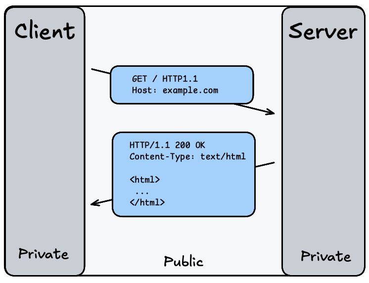
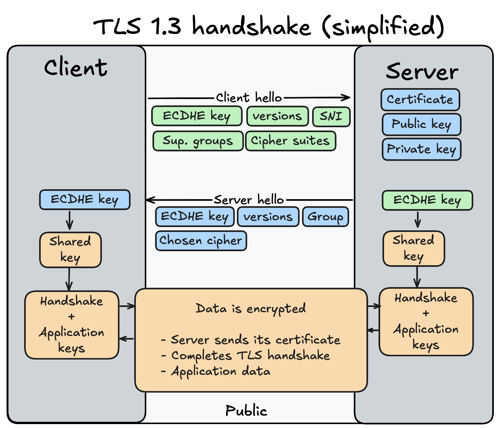
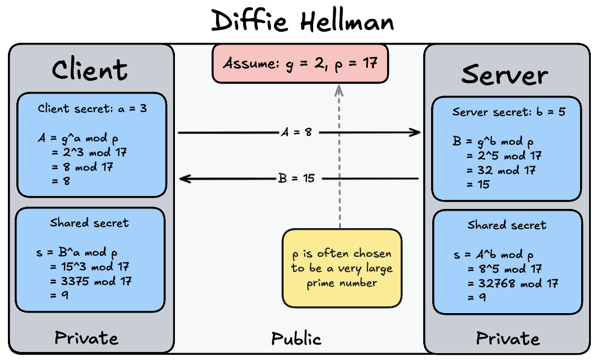
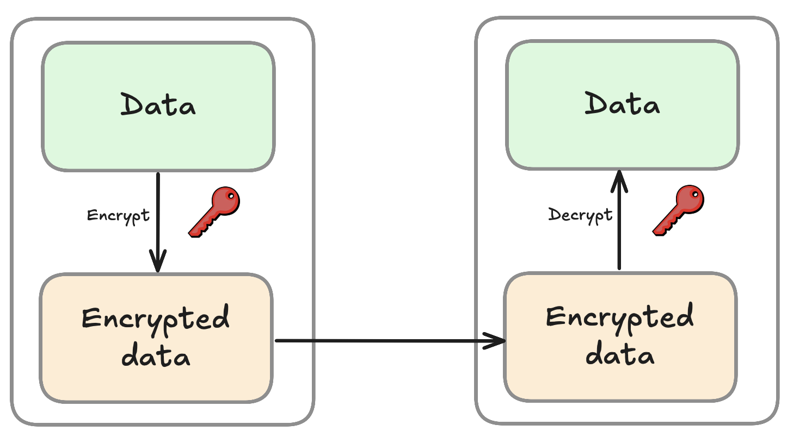
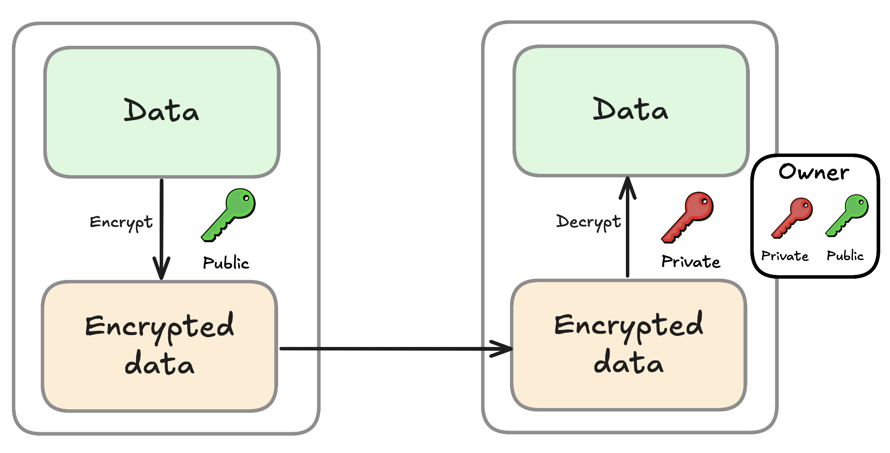

<!-- _class: lead -->

# HTTPS and TLS
### 3rd semester @ Erhvervsakademi København

<!-- ---

# Problems with HTTP
- Data is sent in **plain text**
- Vulnerable to:
  - **Eavesdropping**: Attackers can intercept and read data
    - **Example**: Public Wi-Fi networks
  - **Man-in-the-Middle Attacks**: Attackers can alter data in transit
  - **Data Integrity Issues**: Data can be modified without detection
  - **Lack of Authentication**: No verification of server identity, leading to phishing attacks
- Sensitive information (e.g., passwords, credit card numbers) can be easily compromised -->

---

## HTTP

<!-- _class: img-60 -->

---

## Problem:
> ## Everything sent over HTTP is visible to anyone who can intercept the communication.

---
# Requirements for Secure Communication

**A solution must ensure:**
- **Confidentiality**: Data should be encrypted to prevent eavesdropping
- **Integrity**: Data should not be alterable without detection
- **Authentication**: The server (and optionally the client) should be verified to prevent impersonation

---

## Solution:
> ## Use HTTPS which combines HTTP with TLS to provide secure communication over a computer network.

---

# HTTPS (HyperText Transfer Protocol Secure)

**HTTPS** is an extension of HTTP that uses TLS (or SSL) to encrypt data transmitted between a client and server.

Uses port **443** by default instead of port **80** used by HTTP.

---

# TLS (Transport Layer Security)

**TLS** (Transport Layer Security) is a protocol that provides secure communication over a computer network.

Operates between the **transport layer** and **application layer** of the OSI (TCP/IP) model.

---

## TLS/SSL Versions
- SSL 2.0 (1995): Deprecated due to security flaws
- SSL 3.0 (1996): Improved security, but also deprecated
- TLS 1.0 (1999): Deprecated due to security vulnerabilities (since 2021)
- TLS 1.1 (2006): Improved security, but also deprecated (since 2021)
- **TLS 1.2 (2008):** Widely adopted, supports strong encryption algorithms
- **TLS 1.3 (2018):** Latest version, offers improved security and performance

---

<!-- _class: img-60 -->

---

# Diffie Hellman Key Exchange
**Diffie–Hellman (DH) is a key-exchange algorithm that allows two parties to create a shared secret key over an insecure channel without eversending the key itself.**
1. Both parties agree on a large prime number (`p`) and a base (`g`).
2. Each party selects a private key (`a` for Client, `b` for Server).
3. Each party computes their public key `A` and `B`:
   <!-- - Client computes `A = g^a mod p`
   - Server computes `B = g^b mod p` -->
4. They exchange public keys (`A` and `B`).
5. Each party computes the shared secret.

---

<!-- _class: img-80 -->

---

# Demo: Wireshark HTTPS Traffic

---

# Symmetric Encryption
**Symmetric encryption** uses the same key for both encryption and decryption of data.
- **Examples**: AES (Advanced Encryption Standard), DES (Data Encryption Standard)
- **Advantages**:
  - Fast and efficient for large amounts of data
- **Disadvantages**:
  - Key distribution problem: Securely sharing the key between parties can be challenging

---

## Symmetric Encryption

<!-- _class: img-80 -->

---

# Asymmetric Encryption

**Asymmetric encryption** uses a pair of keys: a public key for encryption and a private key for decryption.
- **Examples**: RSA, ECC
- **Advantages**:
  - Solves the key distribution problem: Public key can be shared openly
- **Disadvantages**:
  - Slower than symmetric encryption, making it less suitable for large amounts of data

---

## Asymmetric Encryption

<!-- _class: img-80 -->

<!-- ---

# Hash Functions
Are cryptographic algorithms that take an input (or 'message') and return a fixed-size string of bytes (digest).
- **Properties:**
  - Deterministic: Same input always produces the same output
  - Fast to compute
  - Pre-image resistance: Difficult to reverse-engineer the input from the output
  - Collision resistance: Difficult to find two different inputs that produce the same output

**Hash functions are not used to encrypt data, but to ensure data integrity.** -->
