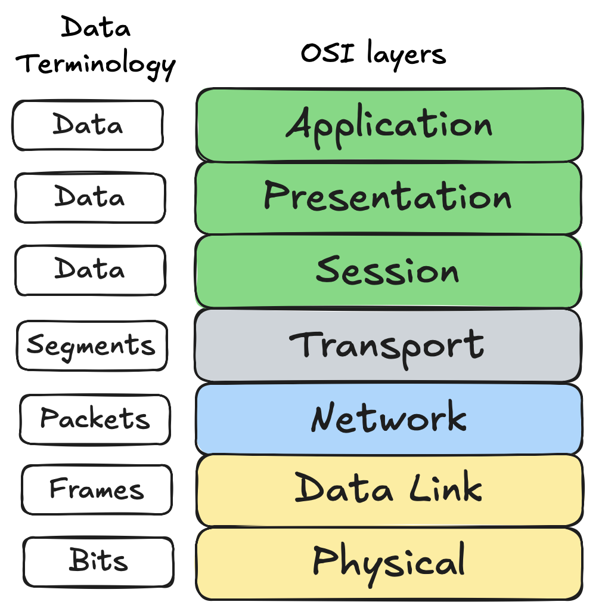
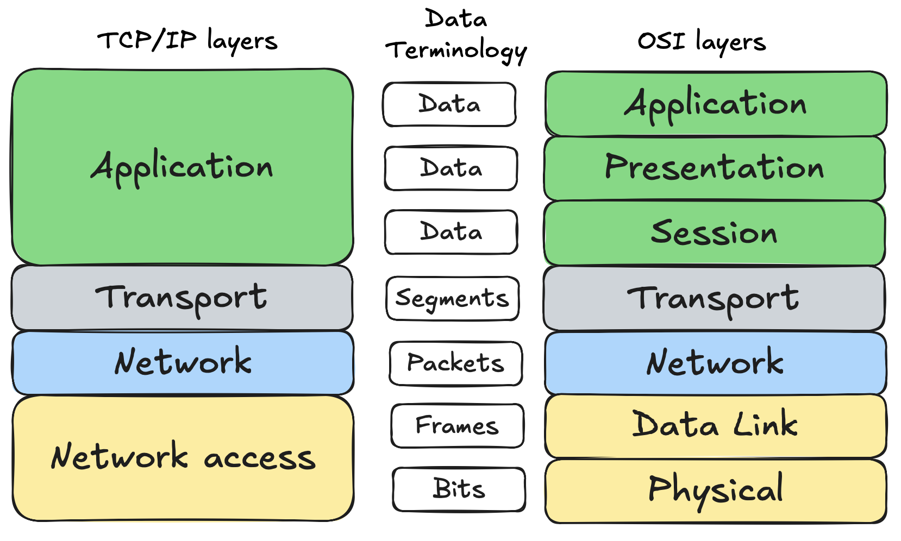
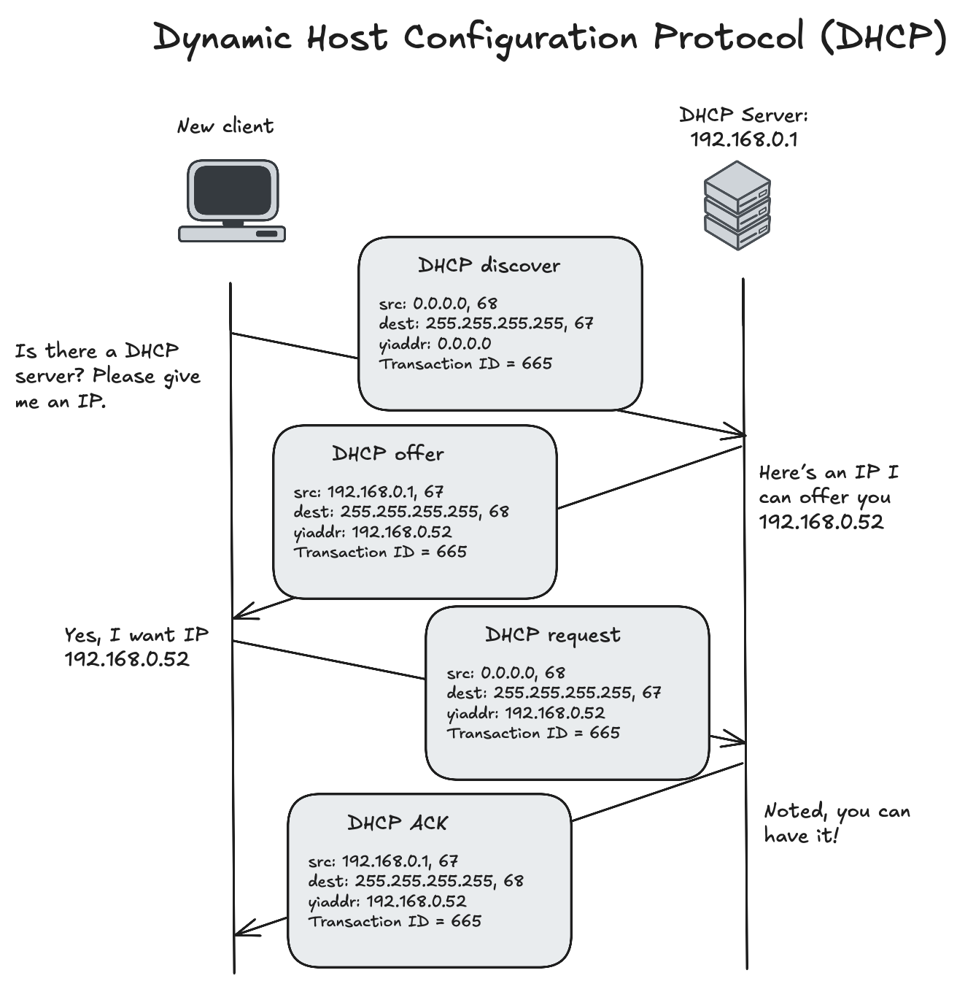
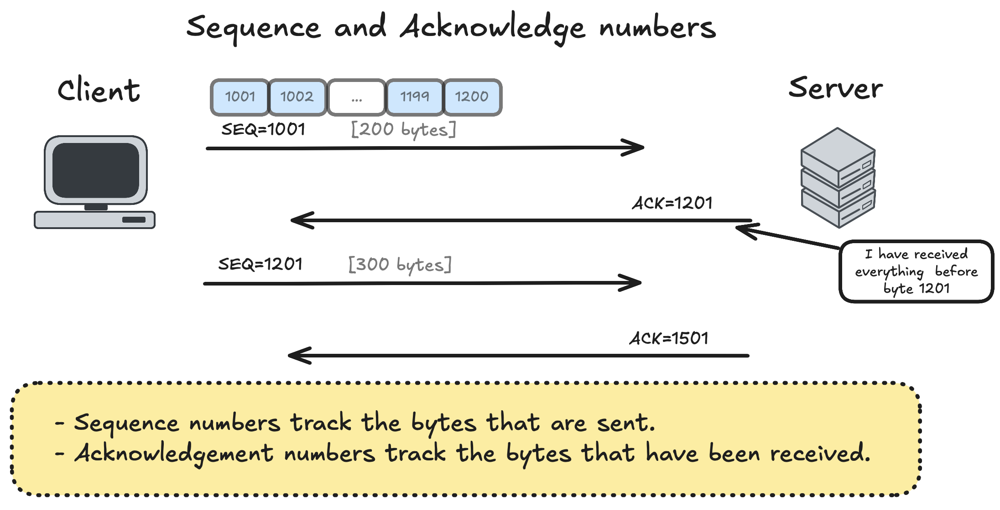
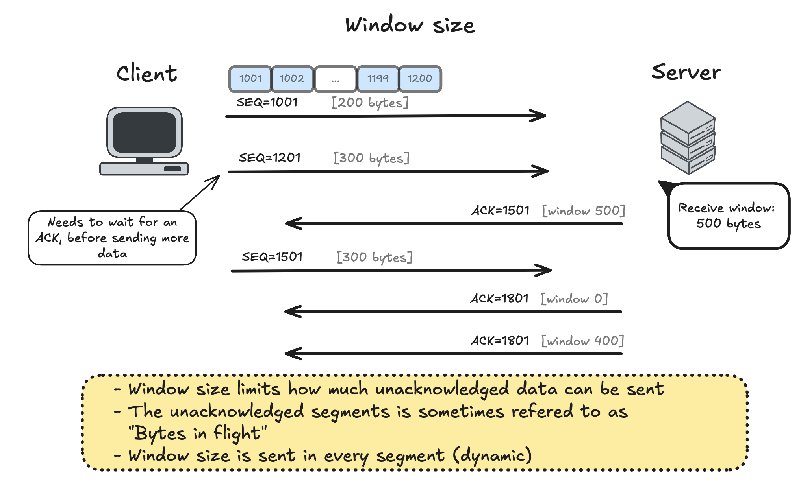
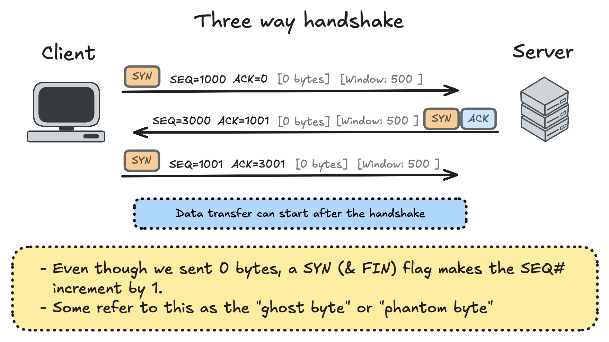

<!-- _class: lead -->

# Computer networks introduction
### 3rd semester @ Erhvervsakademi København

<style>
section.lead h1 {
  text-align: center;
  font-size: 2.5em;
}
section.lead h3 {
  text-align: center;
  opacity: 0.6;
}
</style>

---


## Outline

- Hosts and Networks
- IP addresses
- Subnetting
- Network Devices
- OSI & TCP/IP models
- DHCP
- UDP
- ARP
- DNS
- TCP
- HTTP

---

# Hosts and Networks

A **host** are a device which sends or receives traffic on a network.
- **Clients:** initiate requests
- **Servers:** respond to requests

**IP addresses are used to identify hosts on a network.**
- An **IP address** is the unique identity of each host on a network.
- **IPv4** addresses are 32-bit numbers, written in octets (e.g., **`72.184.216.34`**).

**Networks** are groups of hosts that can communicate with each other.
- A **subnet** is a smaller network within a larger network.

---

# Hosts and Networks


---

## IP addresses


---

## IP addresses hierarchy

- **IANA** (Internet Assigned Numbers Authority) is responsible for global IP address allocation.
- They allocate blocks of IP addresses to **RIRs** (Regional Internet Registries)
- **RIR** allocate smaller blocks to **ISPs** (Internet Service Providers) and organizations.
- **ISPs** then assign IP addresses to end-users and devices (usually they also brake them into smaller subnets).

We will later figure out how an ISP can assign a specific IP address to a specific device.

---

## Subnetting
**Subnetting** means dividing a larger network into smaller, manageable segments called subnets.
- Each subnet functions as its own smaller network, with its own range of IP addresses.
- Subnetting improves performance and security by isolating groups of devices (e.g., separating work computers from guest devices).

---

## Subnet Masks
A **subnet mask** is used to determine which portion of an IP address represents the network and which portion represents the host.
**Example:**
- A subnet mask of **`255.255.255.0`** means the first 24 bits are the **network portion**, and the last **8 bits are for hosts**.
- This allows for **255 IP addresses within that subnet** (some are reserved).
- The broadcast address is the last address in the subnet, used to communicate with all devices on that subnet.
- The first address is the network address, used to identify the subnet itself.

---

## Subnet masks

- Subnet masks: `255.255.255.240` means that the first 28 bits are for the network, and the last 4 bits are for hosts.
- Subnet masks: `255.255.0.0` means that the first 16 bits are for the network, and the last 16 bits are for hosts.

**But there is an easier way to represent this using CIDR** (Classless Inter-Domain Routing) **notation.**
- CIDR notation: `/28` means that the first 28 bits are for the network.
- CIDR notation: `/16` means that the first 16 bits are for the network.

---

# Finding your subnet mask on a Mac/Linux/Windows

- On **Mac/Linux**, open a terminal and type: `ifconfig`
- On **Windows**, open Command Prompt and type: `ipconfig` or `ipconfig /all`

Look for the following information:
- **IP Address** (on Mac look for `inet`)
- **Subnet Mask** (on Mac look for `netmask`)
- **Default Gateway** (on Mac use `netstat -nr | grep default`)

---

# Private vs Public IP Addresses
- **Public IP addresses** are routable on the global Internet.
- **Private IP addresses** are used within local networks and are not directly accessible from the Internet.
- Common private IP ranges:
    - `10.0.0.0` to `10.255.255.255` or `10.0.0.0/8` subnet mask: `255.0.0.0`
    - `172.16.0.0` to `172.31.255.255` or `172.16.0.0/12` subnet mask: `255.240.0.0`
    - `192.168.0.0` to `192.168.255.255` or `192.168.0.0/16` subnet mask: `255.255.0.0`

---

<!-- _class: img-80 -->


<style>
  section.img-80 img {
    max-width: 80%;
    height: auto;
    display: block;
    margin: 0 auto;
  }
</style>

---

## Subnet calculation example

**Given the IP address: `108.156.242.121/11`**

Determine:
- The subnet mask
- The network address
- The broadcast address
- The range of usable IP addresses
- Next subnet

---

# Network Devices
- **Router:** Connects different networks together and routes traffic between them.
- **Switch:** Connects devices within the same network and forwards data based on MAC addresses.
- **Hub:** Basic device that connects multiple Ethernet devices, broadcasting data to all ports.
- **Modem:** Connects a network to the internet, modulating and demodulating signals.
- **Network Interface Card (NIC):** Hardware component that enables a device to connect to a network.

---

## Translating private to public IP addresses
- Devices within a private network use private IP addresses to communicate with each other.
- To access the internet, these private IP addresses need to be translated to a public IP address.
- This is done using a technique called **NAT** (Network Address Translation), typically performed by a router.
- The router maintains a table to keep track of which private IP address corresponds to which public IP address and port number.

---

## Routing traffic
- When a device within a private network wants to access the internet, it sends the request to the router.
- The router translates the private IP address to its public IP address using NAT.
- The router then forwards the request to the appropriate destination on the internet

**But how does it know where to send it?**
- The router uses **a routing table** to determine the best path to the destination IP address.
```
Destination       Netmask           Gateway          Interface
------------------------------------------------------------------
0.0.0.0          0.0.0.0           83.123.3.1        eth1 (WAN)
83.123.3.0       255.255.255.0     0.0.0.0           eth1 (WAN) 
192.168.1.0      255.255.255.0     0.0.0.0           eth0 (LAN)
```
---


<!-- _class: img-80 -->


---

<!-- _class: img-70 -->


<style>
  section.img-70 img {
    max-width: 70%;
    height: auto;
    display: block;
    margin: 0 auto;
  }
</style>

---

# Networking models

- **Purpose of networking:** Allowing two hosts to communicate.
- **Hosts** must follow certain rules (protocols) to communicate effectively.
- **Networking models** help standardize how data is transmitted and received across networks.
- The two most common models are the **OSI model** and the **TCP/IP model**.

---


## OSI model

<!-- _class: flex -->


<div class="flex">
<div>
<p><strong>The OSI (Open Systems Interconnection) model divides rules of networking into 7 layers:</strong></p>
<ul>
  <li>Each layer serves a specific function and communicates with the layers directly above and below it.</li>
    <li>Helps standardize networking protocols and technologies.</li>
</ul>
</div>

</div>

<!--  -->

<style>
  section.flex h2 {
    flex: 1;
    font-size: 1.5em;
  }
  section.flex img {
    max-width: 40%;
    height: auto;
    display: block;
    margin: 0 auto;
  }
  .flex {
    display: flex;
    flex-direction: row;
    justify-content: center;
    align-items: center;
  }
</style>

---

## OSI model

<!-- _class: flex -->


<div class="flex">
<div>
<p><strong>Layer 1 - Physical: Transporting bits</strong></p>
<ul>
  <li>The physical transmission of raw bit streams over a physical medium.</li>
  <li>L1 devices: Cables, WiFi.</li>
</ul>
<!-- <p><strong>Layer 2 - Data Link: Hop to hop</strong></p>
<ul>
  <li>Responsible for node-to-node data transfer and error detection/correction.</li>
  <li>Uses MAC addresses (48 bits) to identify devices on the same network.</li>
  <li>L2 devices: Switches, NICs.</li>
</ul> -->
</div>

</div>

<!--  -->

<style>
  section.flex h2 {
    flex: 1;
    font-size: 1.5em;
  }
  section.flex img {
    max-width: 40%;
    height: auto;
    display: block;
    margin: 0 auto;
  }
  .flex {
    display: flex;
    flex-direction: row;
    justify-content: center;
    align-items: center;
    gap: 1em;
  }
</style>

---

## OSI model

<!-- _class: flex -->


<div class="flex">
<div>
<p><strong>Layer 2 - Data Link: Hop to hop</strong></p>
<ul>
  <li>Responsible for node-to-node data transfer and error detection/correction.</li>
  <li>Uses MAC addresses (48 bits) to identify devices on the same network.</li>
  <li>L2 devices: Switches, NICs.</li>
</ul>
</div>

</div>

<!--  -->

<style>
  section.flex h2 {
    flex: 1;
    font-size: 1.5em;
  }
  section.flex img {
    max-width: 30%;
    height: auto;
    display: block;
    margin: 0 auto;
  }
  .flex {
    display: flex;
    flex-direction: row;
    justify-content: center;
    align-items: center;
    gap: 1em;
  }
</style>

---

## OSI model

<!-- _class: flex -->


<div class="flex">
<div>
<p><strong>Layer 3 - Network: End to end</strong></p>
<ul>
  <li>Responsible for routing end-to-end packets across different networks.</li>
  <li>Uses IP addresses to identify devices on different networks.</li>
  <li>L3 devices: Routers.</li>
</ul>
</div>

</div>

<!--  -->

<style>
  section.flex h2 {
    flex: 1;
    font-size: 1.5em;
  }
  section.flex img {
    max-width: 30%;
    height: auto;
    display: block;
    margin: 0 auto;
  }
  .flex {
    display: flex;
    flex-direction: row;
    justify-content: center;
    align-items: center;
    gap: 1em;
  }
</style>

---

## OSI model

<!-- _class: flex -->


<div class="flex">
<div>
<p><strong>Layer 4 - Transport: Service to service</strong></p>
<ul>
  <li>Responsible for providing data transfer services to the upper layers.</li>
  <li>Uses port numbers to identify specific processes or services on a device.</li>
  <li>Uses TCP and UDP protocols for communication.</li>
  <li>L4 devices: Firewalls, Load Balancers.</li>
</ul>
</div>

</div>

<!--  -->

<style>
  section.flex h2 {
    flex: 1;
    font-size: 1.5em;
  }
  section.flex img {
    max-width: 30%;
    height: auto;
    display: block;
    margin: 0 auto;
  }
  .flex {
    display: flex;
    flex-direction: row;
    justify-content: center;
    align-items: center;
    gap: 1em;
  }
</style>

---


## OSI model

<!-- _class: flex -->


<div class="flex">
<div>
<p><strong>Layer 5-7 - Application: End user</strong></p>
<ul>
  <li>These layers are responsible for providing network services directly to end-users and applications.</li>
  <li>Includes protocols like HTTP, FTP, SMTP, and DNS.</li>
  <li>Some models combine these three layers into a single Application layer.</li>
</ul>
</div>

</div>

<!--  -->

<style>
  section.flex h2 {
    flex: 1;
    font-size: 1.5em;
  }
  section.flex img {
    max-width: 30%;
    height: auto;
    display: block;
    margin: 0 auto;
  }
  .flex {
    display: flex;
    flex-direction: row;
    justify-content: center;
    align-items: center;
    gap: 1em;
  }
</style>

---

## TCP/IP vs OSI model

<!-- _class: img-80 -->



<style>
  section.img-80 img {
    max-width: 80%;
    height: auto;
    display: block;
    margin: 0 auto;
  }
</style>

---


---

# Example

- Identifying ports, ip addresses and mac addresses in a network capture for a HTTP request.


---

# DHCP

**DHCP** (Dynamic Host Configuration Protocol) is a network protocol used to automatically assign IP addresses and other network configuration parameters to devices on a network.
- When a device connects to a network, it needs an IP address.
- DHCP automates the process of assigning IP addresses, subnet masks, default gateways, and DNS server information.
- This reduces the need for manual configuration and helps prevent IP address conflicts.

---

<!-- _class: img-50 -->



<style>
  section.img-50 img {
    max-width: 50%;
    height: auto;
    display: block;
    margin: 0 auto;
  }
</style>

---

# WireShark example

---

# UDP

**UDP** (User Datagram Protocol) is a connectionless transport layer protocol used for transmitting data over IP networks.
- **UDP does not establish a connection before sending data**, making it **faster** but l**ess reliable than TCP** (Transmission Control Protocol).
- It does **not guarantee the delivery, order, or integrity** of the data packets.
- UDP is commonly used for applications that require **low latency** and can tolerate some data loss, such as video streaming, online gaming, and VoIP (Voice over IP).
- Protocols that use UDP include **DNS** (Domain Name System) and **DHCP** (Dynamic Host Configuration Protocol).

---

# ARP

**ARP** (Address Resolution Protocol) is a network protocol used to map an IP address to a MAC address within a local network.
- When a device wants to communicate with another device on the same local network, it needs to know the MAC address associated with the target device's IP address.
- The device sends an ARP request to all devices on the local network, asking "Who has this IP address?"
- The device with the matching IP address responds with its MAC address.
- The requesting device can then use this MAC address to send data directly to the target device.

---

<!-- _class: img-80 -->


---

<!-- _class: img-80 -->


---

## ARP table

- Each device maintains an **ARP table** (or cache) that stores recently resolved IP-to-MAC address mappings.
- This table helps speed up communication by avoiding the need to send ARP requests for every packet.
- ARP entries typically have a timeout period, after which they are removed from the table to ensure that the mappings remain up-to-date.


**See ARP table on your computer:**
```bash
arp -a
```

---

# ARP example in WireShark

---

# DNS

**DNS** (Domain Name System) is a hierarchical and decentralized naming system used to translate human-readable domain names (like www.example.com) into IP addresses.

</br>

> We can use tools like `nslookup` or `dig` to query DNS servers and retrieve information about domain names and their associated IP addresses.

---

# DNS Example in WireShark

---

# TCP

Before data is sent over the internet, it is often broken down into smaller packets using the **TCP** (Transmission Control Protocol).
- TCP ensures reliable delivery of data by establishing a connection between the sender and receiver.
- It uses sequence numbers and acknowledgments to track packets and ensure they are received in the correct order.
- If a packet is lost or corrupted during transmission, TCP will retransmit it.
- TCP is used for applications that require reliable data transfer, such as web browsing (HTTP/HTTPS), email (SMTP), and file transfers (FTP).


---

## TCP Header

<!-- _class: img-50 -->


<style>
  section.img-50 img {
    max-width: 50%;
    height: auto;
    display: block;
    margin: 0 auto;
  }
</style>

---


<!-- _class: img-90 -->




<!-- <style>
  section.img-90 img {
    max-width: 90%;
    height: auto;
    display: block;
    margin: 0 auto;
  }
</style> -->

---


---


---


---

<!-- _class: img-90 -->



<style>
  section.img-90 img {
    max-width: 90%;
    height: auto;
    display: block;
    margin: 0 auto;
  }
</style>

---

<!-- _class: img-90 -->


<style>
  section.img-90 img {
    max-width: 90%;
    height: auto;
    display: block;
    margin: 0 auto;
  }
</style>

---

## TCP handshake

To start a TCP connection, the client and server need to tell each other:
- The Initial Sequence Numbers (ISNs).
- The Window Size (how much data can be sent before receiving an acknowledgment).
- The TCP options (like Maximum Segment Size).
- This is done using a process called the **Three-Way Handshake**:


---

## Three-way handshake

Every TCP connection begins with a three-way handshake with 4 events:

1. Client -> Server: **SYN**chronize with my initial sequence number (ISN) `X`.
2. Server -> Client: I received your **SYN**, and **ACK**nowledge that im ready for `X+1`
3. Server -> Client: **SYN**chronize with my initial sequence number (ISN) `Y`.
4. Client -> Server: I received your **SYN**, and **ACK**nowledge that im ready for `Y+1`

**Since event 2 and 3 do not overlap, they are combined into a single packet: SYN-ACK.**

> **The SYN flag is used to initiate a connection, and the ACK flag is used to acknowledge receipt of data.**

---



---

## Closing a TCP connection

There a two ways for TCP to close a connection: using the **FIN** flag or the **RST** flag.
- **FIN** (Finish) flag is used for a graceful connection termination, where both sides agree to close the connection.
- **RST** (Reset) flag is used for an abrupt termination, often due to errors or unexpected conditions.

---

## Closing a TCP gracefully with `FIN` flag

It uses a four-way handshake with 4 events:

1. Client -> Server: I have **FIN**ished sending data, my last sequence number is `X`.
2. Server -> Client: I **ACK**nowledge receiving your **FIN** with **ACK#** `X+1`.
3. Server -> Client: I have **FIN**ished sending data, my last sequence number is `Y`.
4. Client -> Server: I **ACK**nowledge receiving your **FIN** with **ACK#** `Y+1`.

---


<!-- Bumping the sequence number by 1 for the FIN flag, makes previous segments distinguishable from the FIN segment. -->

---

## Closing a TCP abruptly with `RST` flag

- The **RST** flag is used to immediately terminate a TCP connection.
- It can be sent by either the client or server when an error occurs or when a connection needs to be closed unexpectedly.
- When a device receives a TCP segment with the RST flag set, it immediately terminates the connection without any further communication.
- `RST`segments do not need to be **ACK**nowledged.

---


## Recap of TCP
- TCP provides **reliable**, **ordered**, and error-checked delivery of data between applications.
- It uses **sequence numbers** and **acknowledgments** to track packets and ensure they are received correctly.
- TCP establishes connections using a **three-way handshake** and closes them with a **four-way handshake**.
- TCP lives at **Layer 4 (Transport Layer)** of the OSI model.

</br>

**Question:** *What happens when data is not received correctly?*

---

<!-- _class: img-90 -->


<style>
  section.img-90 img {
    max-width: 90%;
    height: auto;
    display: block;
    margin: 0 auto;
  }
</style>

---

# Demo: 
## **TCP three-way handshake and data transfer in WireShark**

---

## How much data can be sent in one TCP segment?
- The amount of data that can be sent in a single TCP segment is determined by the **Maximum Segment Size (MSS)**.
- MSS is negotiated during the TCP three-way handshake using the TCP options field.
- The MSS value specifies the largest amount of data, in bytes, that a device is willing to receive in a single TCP segment.
- The MSS value is typically based on the **Maximum Transmission Unit (MTU)** of the underlying network (MTU is the largest size of a packet that can be transmitted over a network).
- For example, if the MTU is 1500 bytes (common for Ethernet), the MSS is usually set to 1460 bytes (1500 bytes - 20 bytes for the IP header - 20 bytes for the TCP header).


---

# TCP extras 

- **TCP Keep-Alive** - a mechanism used to check if a TCP connection is still active by sending periodic messages between the client and server.
- **TCP Congestion Control** - techniques used to prevent network congestion by adjusting the rate of data transmission based on network conditions.
- **TCP Fast Retransmit** - a mechanism that allows for quicker retransmission of lost packets by detecting packet loss through duplicate acknowledgments.
- **TCP Selective Acknowledgment (SACK)** - allows the receiver to inform the sender about all segments that have been received successfully, enabling more efficient retransmission of lost segments.

---

## TCP vs UDP

- **TCP** (Transmission Control Protocol) is a connection-oriented protocol that provides reliable data transfer with error checking, flow control, and congestion control. It is suitable for applications that require guaranteed delivery of data, such as web browsing, email, and file transfers.
- **UDP** (User Datagram Protocol) is a connectionless protocol that does not guarantee delivery, order, or error checking. It is faster and more efficient for applications that can tolerate some data loss, such as video streaming, online gaming, and VoIP.

> Newer protocols tend to use UDP for speed, and implement reliability on top of it if needed (e.g., QUIC)

---

# HTTP
**HTTP** (Hypertext Transfer Protocol) is the foundation of data communication on the World Wide Web.
- It is an **application layer protocol** used for transmitting hypertext (web pages) between a client
and a server.
- HTTP follows a request-response model, where the client sends a request to the server, and the server responds with the requested resource.
- HTTP is stateless, meaning each request is independent and does not retain any information about previous requests.
- HTTPS (HTTP Secure) is a secure version of HTTP that uses encryption (SSL/TLS) to protect data during transmission.

---

## HTTP and network layers

- HTTP operates at the **Application Layer** (Layer 7) of the OSI model.
- It relies on lower layers (Transport, Network, Data Link, Physical) to handle data transmission over the network.
- HTTP typically uses **TCP** as its transport protocol, specifically on port **80** for HTTP and **443** for HTTPS.

</br>

**Question:** *Why does HTTP use TCP instead of UDP?*

---

## HTTP (protocol format)

- An HTTP message consists of a **start line**, **headers**, and an optional **body**.
- The **start line** indicates the type of message (request or response) and contains important information such as the HTTP method, URL, and version.
- **Headers** provide additional information about the request or response, such as content type, content length, and caching directives.
- The **body** contains the actual data being transmitted, such as HTML content, images, or other resources.

---

## HTTP (protocol format) cont.

**GET request example:**
```http
GET / HTTP/1.1
Host: www.example.com
Accept: text/html

```

**Response example:**
```http
HTTP/1.1 200 OK
Content-Type: text/html

<html>
  <body>
  ...
  </body>
</html>
```
---

# HTTP in browsers vs curl

When using HTTP in browsers, the browser often add the header: 
- `Accept-Encoding: gzip, deflate`

**This reduces bandwidth and latency, making the page load faster - Since the data is compressed (fewer TCP packets need to be transfered).**

---

# Demo:  
## **HTTP in WireShark**
